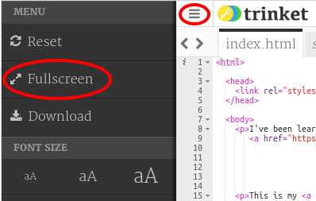
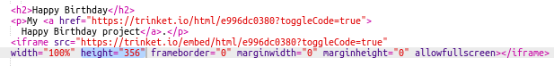
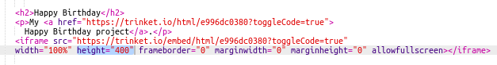

## Pag-embed ng mga Proyekto

Pati na rin ang pag-link sa mga trinkets bilang mga webpage ay maaari rin nating i-embed ang mga ito sa isang web page.

+ Maaari mong subukang magtrabaho sa Fullscreen mode upang magkaroon ka ng mas maraming space:

Pindutin ang Esc upang lumabas sa Fullscreen Mode.

+ Patakbuhin ang iyong trinket at i-click ang link ng Maligayang Kaarawan.

+ I-click ang menu ng trinket at piliin ang** embed **. Kung wala ka sa Fullscreen mode ay maaaring kailangan mong mag-scroll. Gamitin ang scroll bar sa kanan o ang down arrow sa keyboard.

+ Piliin ang 'Ipakita lamang ang code o resulta (hayaan lamang ang gumagamit na magpalipat-lipat sa pagitan ng dalawang ito)' at **kopyahin** ang embed code para sa trinket. 

+ Ang Trinket ay lumikha ng ilang HTML para sa iyo upang maisama sa iyong webpage. Gumagamit ito ng isang `<iframe>` tag na nagbibigay-daan sa nilalaman na ma-embed sa loob ng isang page.

+ Ngayon i-paste ang code na iyon sa ilalim ng link sa Maligayang Kaarawan trinket:

+ Patakbuhin ang iyong trinket upang ma-test ito at dapat mong makita ang iyong Maligayang Kaarawan na proyekto na naka-embed sa webpage. 

+ Maaari mong makita na ang ilalim ng iyong trinket ay hindi naka-display. Maaari mong ayusin iyon sa pamamagitan ng pagbabago ng height value sa `<iframe>`. 

I-set ang height sa ** 400 **. Kung gumawa ka ng mga pagbabago sa proyekto ng Maligayang Kaarawan ay maaaring kailangan mong pumili ng ibang value.

