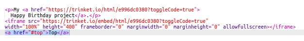

## Pagbabalik sa pinakasimula

+ Kapaki-pakinabang din mag-navigate pabalik sa tuktok ng pahina. Ang HTML ay mayroong ` #top ` para sa layuning ito.

+ Magdagdag ng isang link sa ` #top ` pagkatapos ng bawat naka-embed na proyekto sa iyong webpage:

+ Subukan ang iyong mga link sa pamamagitan ng pag-click sa Itaas upang makabalik sa tuktok ng pahina.