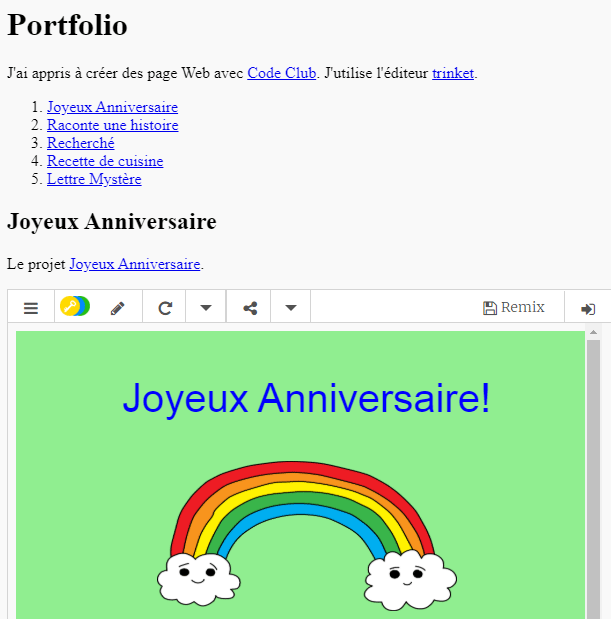

## Introduction

Dans ce projet, tu vas créer un portfolio de tes projets HTML et en savoir plus sur les liens et l’intégration de ressources.

### Informations supplémentaires pour les responsables de club

Si vous avez besoin d'imprimer ce projet, merci d'utiliser la [version imprimable](https://projects.raspberrypi.org/fr-FR/projects/project-showcase/print).

--- collapse ---
---
title: Notes pour le responsable de club
---

## Introduction :

Dans ce projet, les enfants se familiarisent avec les hyperliens et l'intégration de Trinkets et de projets Scratch dans une page Web.

## Ressources en ligne

Nous vous recommandons d'utiliser des [Trinkets](https://trinket.io/) pour écrire en HTML & CSS en ligne. Ce projet contient le Trinket suivant :

* [Point de départ de « Portfolio » - jumpto.cc/web-showcase](https://trinket.io/html/4a3af3be01)

Les enfants peuvent également utiliser ce Trinket vide [(jumpto.cc/html-blank)](http://jumpto.cc/html-blank) pour écrire leur propre code HTML & CSS, ou utiliser ce Trinket modèle [(jumpto.cc/html-template)](http://jumpto.cc/html-template).

Il y a aussi un Trinket contenant un exemple de solution pour les défis :

* [« Portfolio terminé » - trinket.io/html/b326b608c3](https://trinket.io/html/b326b608c3)

## Ressources hors-ligne

Ce projet peut être [terminé hors-ligne](https://www.codeclubprojects.org/en-GB/resources/webdev-working-offline/) si désiré. Vous pouvez accéder aux ressources du projet en cliquant sur le lien « Ressources du projet ». Ce lien contient une section « Ressources du projet » qui inclut les ressources dont les enfants auront besoin pour compléter le projet hors-ligne. Assurez-vous que chaque enfant a accès à une copie de ces ressources. Cette section inclut les fichiers suivants :

* projet-showcase / index.html
* projet-showcase / style.css
* template/template.html
* template/style.css

Vous pouvez aussi trouver une version terminée des défis de ce projet dans la section « Ressources du bénévole » qui contient :

* project-showcase-finished/index.html
* project-showcase-finished/style.css

(Toutes les ressources ci-dessus peuvent aussi être téléchargées dans les fichiers `.zip` projet et bénévole)

Notez que si les enfants ont terminé leurs autres projets hors-ligne, ils ne pourront pas les intégrer, mais ils pourront toujours les lier.

## Objectifs d'apprentissage

* Ce projet introduit des liens sous forme texte vers d'autres pages Web et vers des identifiants nommés au sein d'une page. Il présente aussi comment intégrer des Trinkets et des projets Scratch dans une page Web. 

Ce projet couvre les éléments suivants du [Programme de Créativité Numérique de Raspberry Pi](http://rpf.io/curriculum) :

* [Concevoir des éléments de base en 2D et 3D](https://www.raspberrypi.org/curriculum/design/creator){: target="_blank}.

## Défis

* « Ajouter un autre lien » - Ajouter des liens vers d'autres pages Web ;
* « Créer une liste de tes projets » - Créer des liens vers des projets Web précédents ;
* « Intégrer plus de projets » - Utiliser CSS pour créer de nouveaux styles.

--- /collapse ---

--- collapse ---
---
title: Matériel pour le projet
---

## Ressources pour le projet

* [Fichier .zip contenant toutes les ressources du projet](https://rpf.io/p/fr-FR/project-showcase-go)
* [Trinket en ligne contenant toutes les ressources du projet « Portfolio »](https://trinket.io/html/4a3af3be01)
* [Modèle de Trinket en ligne](http://jumpto.cc/trinket-template)
* [Trinket vierge](http://jumpto.cc/trinket-blank)
* [template/index.html](resources/template-index.html)
* [template/style.css](resources/template-style.css)
* [project-showcase/index.html](resources/project-showcase-index.html)
* [project-showcase/style.css](resources/project-showcase-style.css)

## Ressources pour le responsable de club

* [Fichier .zip contenant toutes les ressources du projet terminé](https://rpf.io/p/fr-FR/project-showcase-go)
* [Projet Trinket en ligne terminé](https://trinket.io/html/b326b608c3)
* [project-showcase-finished/index.html](resources/project-showcase-finished-index.html)
* [project-showcase-finished/style.css](resources/project-showcase-finished-style.css)

--- /collapse ---