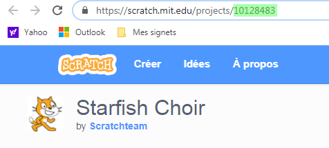

--- challenge ---
## Défi: Crée un nouveau showcase

Trinkets n'est pas la seule chose que tu peux embarquer dans une page web. Tu peux incorporer des videos, gadgets ou des projets Scratch.

Ouvre le Trinket Exemple Scratch et lance le: <a href="https://trinket.io/html/9f7212b8fe">https://trinket.io/html/9f7212b8fe</a>

Va sur le site web de Scratch et trouve un projet que tu aimes bien. Ca peut etre un des tiens ou un que tu as trouvé.

Si tu es enregistré tu peux cliquer sur le bouton 'Embed' en dessous du projet que tu as choisi pour recupérer le code HTML et l'incorporer à ton projet.

Si tu n'es pas enregistré, cherche un numero de projet Scratch dans son addresse web.

Créer une copie de ton exemple Scratch `<iframe>` et change le numero pour importer le projet que tu veux ajouter à ta page.
Make a copy of the `<iframe>` code in the Scratch Embed example and change the project number to the one for the project you want to embed:

--- /challenge ---