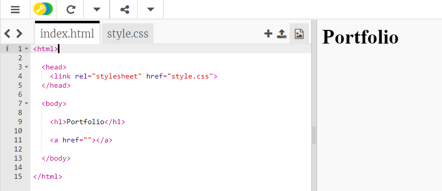
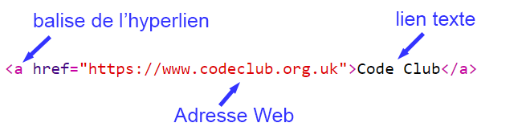
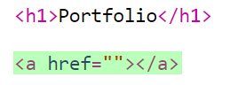
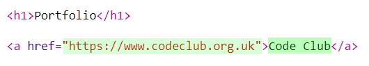
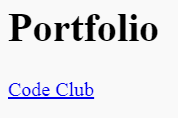
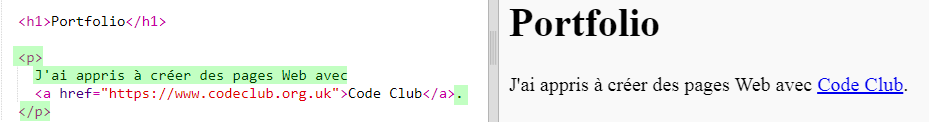

## Ajout de liens vers des pages Web

Les liens de texte te permettent de cliquer sur des mots pour accéder à une autre page Web. ils sont généralement soulignés.

+ Ouvre ce trinket : [trinket.io/html/4a3af3be01](https://trinket.io/html/4a3af3be01).
    
    Le projet devrait ressembler à ceci :
    
    

+ HTML utilise la balise `<a>` pour les liens.

+ Trouve la balise `<a>` dans ton projet. 

+ Ajoute l'adresse du site Web Code Club [`https://www.codeclub.org.uk`](https://www.codeclub.org.uk) et le texte du lien :

+ Clique sur « Exécuter » pour tester ton trinket.

+ Clique sur le lien Code Club pour tester ta page Web. Ton trinket affichera maintenant la page Web Code Club : 

+ Pour revenir à ta page, tu peux soit :
    
    + Relancer ton trinket,
    
    + Appuyer sur la touche Retour arrière du clavier ou
    
    + Cliquer avec le bouton droit et choisir « Retour ».

+ Maintenant, mets ton lien dans une phrase à l'intérieur d'un paragraphe :

Teste ta page Web.