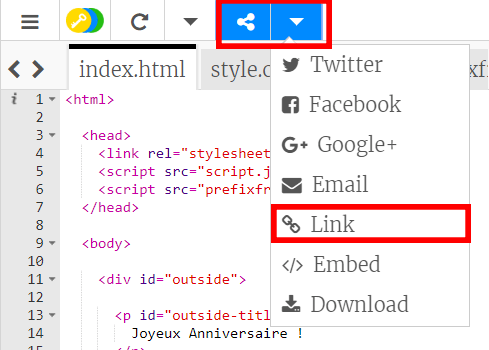
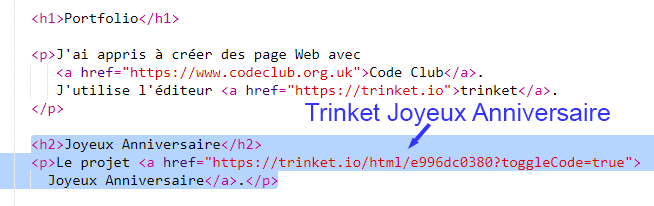
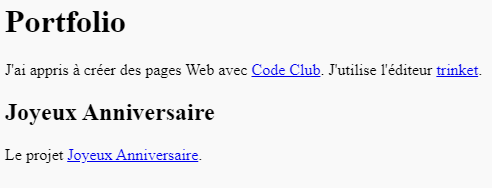

## Lien vers un Trinket

Tu peux créer un lien vers la page Web pour un trinket.

+ As-tu gardé un lien vers ton trinket « Joyeux Anniversaire » ? Si tu l'as fait alors ouvre ce trinket dans un autre onglet ou une autre fenêtre du navigateur. Sinon, ouvre le trinket exemple terminé : <https://trinket.io/html/58c767ac03>

+ Clique sur le menu « Share » au-dessus de ton trinket et choisis « Link » :

Si tu as ouvert le trinket à partir de ton compte, recherche l'option « Share » au-dessus de ton trinket :

+ Choisis « Show code or result (laisse les utilisateurs basculer entre eux) » et copie le lien dans le trinket. 

+ Retourne à ton trinket « Portfolio » et ajoute un `<h2>` titre et un lien vers ton projet « Joyeux Anniversaire ».

Teste ta page Web, çà devrait ressembler à ceci :

Clique sur le lien « Joyeux Anniversaire » pour vérifier qu'il te dirige bien vers le trinket.