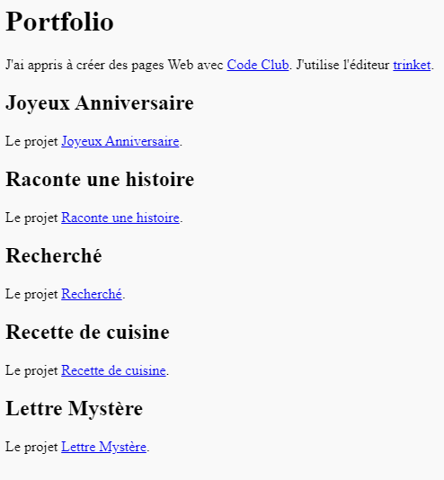

--- challenge ---

## Défi: créer une liste de tes projets

Ajoute certains des autres projets CSS HTML & que tu as créés au Code Club. Utilise les `<h2>` titres pour organiser ta page Web.

Si tu n'as pas de liens vers les projets que tu as créés, tu peux utiliser les exemples Code Club :

+ Joyeux Anniversaire : <https://trinket.io/html/58c767ac03>

+ Raconte une histoire : <https://trinket.io/html/998959ec74>

+ Recherché : <https://trinket.io/html/966af4db2a>

+ Recette de cuisine : <https://trinket.io/html/c714be52bf>

+ Lettre Mystère : <https://trinket.io/html/92dfb263a5>

Ta page finie devrait ressembler à ceci :

--- /challenge ---