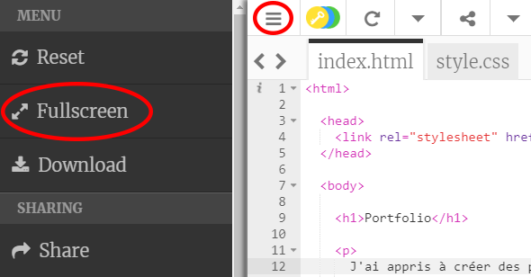
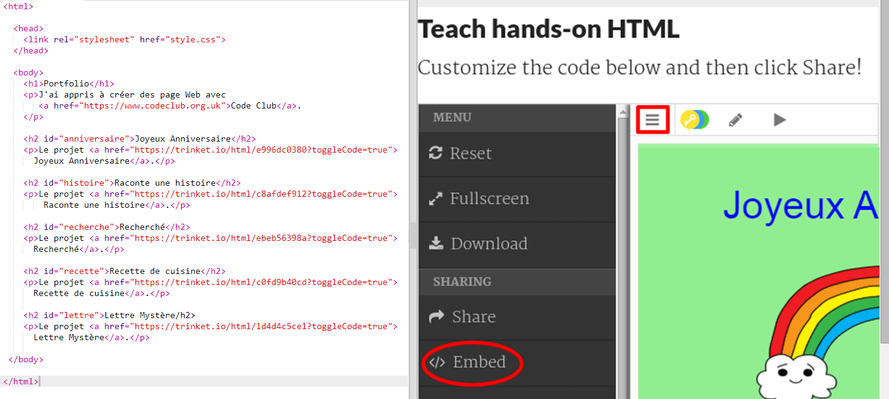
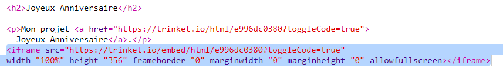
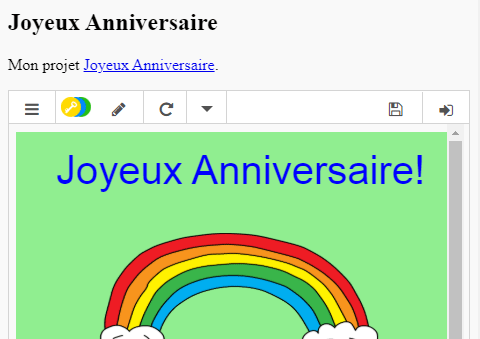
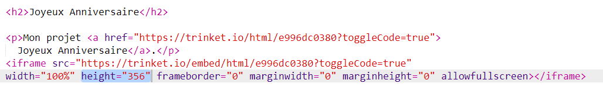
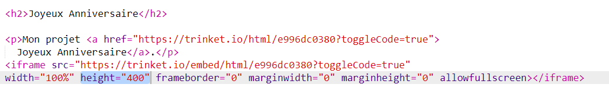

## Embarque encore plus de projets

En plus de lié des trinkets tes pages web, tu peux aussi embarqué tes trinkets dans ta page web.

+ Tu peux essayer de travailler en mode plein-écran comme ça tu auras plus de place:

Appuye sur Esc pour quitter le mode plein-écran

+ Lance ton trinket et clique sur le lien Joyeux Anniversaire

+ Clique sur le menu trinket et choisi __embed__. Si tu n'es pas en plein-écran tu devras peut être faire défiler ta page web. Utilise la barre de défilement a droite ou la flêche du bas.

## Activity Checklist { .check}

+ Choisi 'Only show code or result (let users toggle between them)' et __copie__ le code embarqué pour ce trinket.

+ Trinket a crée un peu de HTML pour toi pour ajouter a ta page web. En utilisant un élément `<iframe>` qui te permet d'embarquer du contenu dans ta page.

+ Maintenant colle ce code sous le lien de ton trinket Joyeux Anniversaire:

+ Lance ton trinket pour le tester et regarde si tu peux voir ton project Joyeux Anniversaire dans ta page web.

+ Tu verras que le bas de ton trinket ne s'affiche pas. Tu peux changer cela en changeant la hauteur de l'élément `<iframe>`.

Défini la hauteur a __400__. Si tu changes le projet Joyeux Anniversaire tu devras peut etre utiliser une valeur différentes.

