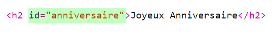
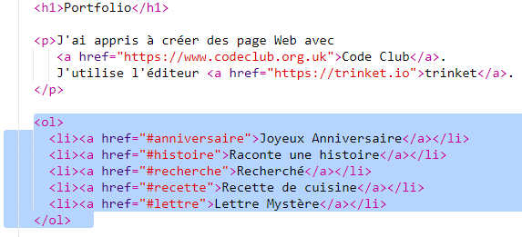
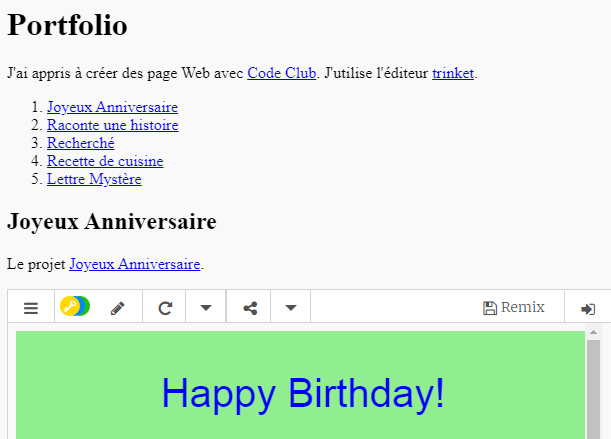

##  Crée un sommaire

Maintenant ajoutons un sommaire pour facilement trouver chaque projet.

+ EN plus d'être capable de créer des liens vers d'autres page, on peux créer un lien qui mène a un endroit d'une page si on lui donne un id.

Ajoute un id au titre `<h2>` pour le projet Joyeux Anniversaire:

+ Ajoute un id pour chaque projets et donne leur un nom court: histoire, wanted, recette et lettre.

+ Tu peux crée un lien vers un élément avec un id en ajoutant un symbole dièse (hashtag) au debut de son nom, `#anniversaire`. 

Créer une liste de liens vers tes projets. (Tu as appris les listes ordonnées dans le projet recette de cuisine).

+ Lance ton projet et test le en cliquant sur les liens pour faire défiller ta page vers tes projets

