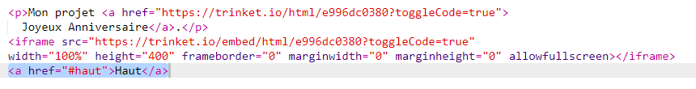
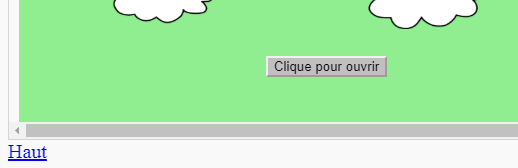

## Revenir en haut

+ Il est également utile de pouvoir revenir en haut de la page. HTML a `#haut` pour cela.

+ Ajoute un lien vers `#haut` après chaque projet intégré dans ta page Web :

+ Teste tes liens en cliquant sur « Haut » pour revenir en haut de la page.