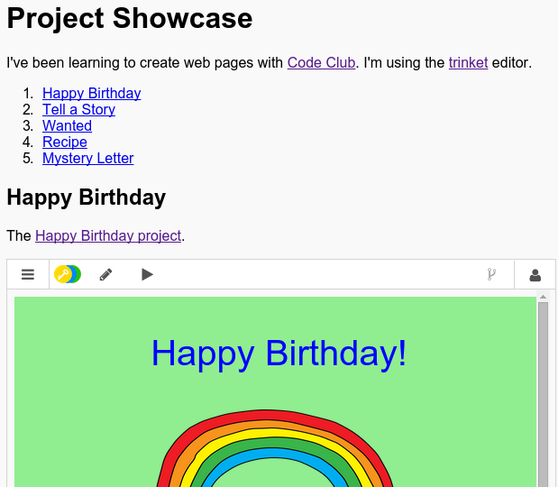

## परिचय

इस परियोजना में आप आपके HTML परियोजना की प्रदर्शनी बनाएंगे और लिंक्स तथा संसाधनों को HTML में जोड़ने के बारे में सीखेंगे।

### क्लब लीडरों के लिए अतिरिक्त जानकारी

यदि आप इस परियोजना को प्रिंट करना चाहते हैं, तो कृपया [प्रिंटर अनुकूल संस्करण](https://projects.raspberrypi.org/en/projects/project-showcase/print) का उपयोग करें।

## \--- collapse \---

## title: क्लब नेता नोट्स

## परिचय:

इस परियोजना में बच्चों को हाइप... और ट्र... और स्क... परियोजनाएं को वेबपेज में जोड़ने से परिचित किया जाता हैं।

## ऑनलाइन संसाधन

HTML & CSS को ऑनलाइन लिखने के लिए हम [trinket](https://trinket.io/) का उपयोग करने की अनुशंसा करते हैं। इस प्रोजेक्ट में निम्नलिखित Trinket हैं:

* ['प्रोजेक्ट शोकेस' प्रारंभिक बिंदु - jumpto.cc/web-showcase](http://jumpto.cc/web-showcase)

बच्चे स्वयं का HTML & CSS लिखने के लिए इस [(jumpto.cc/html-blank)](http://jumpto.cc/html-blank) खाली ट्रिंकेट का भी उपयोग कर सकते हैं, या वैकल्पिक तौर पर वे इस टैंपलेट ट्रिंकेट का उपयोग कर सकते हैं [(jumpto.cc/html-template)](http://jumpto.cc/html-template)।

ऐसा ट्रिंकेट भी होता है, जिसमें चुनौतियों के लिए हल का नमूना शामिल होता है:

* ['प्रोजेक्ट शोकेस पुर्ण' - trinket.io/html/5b815ab120](https://trinket.io/html/5b815ab120)

## ऑफ़लाइन संसाधन

यदि चाहें तो इस परियोजना को [ऑफ़लाइन पूरा](https://www.codeclubprojects.org/en-GB/resources/webdev-working-offline/) किया जा सकता है। आप इस परियोजना के लिए 'परियोजना सामग्री' लिंक पर क्लिक करके परियोजना के संसाधनों पर पहुँच प्राप्त कर सकते हैं। इस लिंक में 'परियोजना संसाधन' खंड है, जिसमें ऐसे संसाधन सम्मिलित हैं जिनकी बच्चों को इस परियोजना को ऑफ़लाइन पूरा करने के लिए ज़रूरत होगी। सुनिश्चित करें कि प्रत्येक बच्चे को इन संसाधनों की प्रतिलिपि तक पहुँच प्राप्त होती है। इस खंड में निम्नलिखित फाइलें शामिल हैं:

* project-showcase/index.html
* project-showcase/style.css
* template/template.html
* template/style.css

आप इस परियोजना की चुनौतियों का पूर्ण संस्करण ‘स्वयंसेवक संसाधन’ भाग में भी देख सकते हैं, जिसमें ये शामिल हैं:

* project-showcse-finished/index.html
* project-showcse-finished/style.css

(उपर्युक्त सभी संसाधन परियोजना और स्वयंसेवक `.zip` फ़ाइलों के रूप में भी डाउनलोड किए जा सकते हैं।)

ध्यान दें कि यदि बच्चों ने अपनी अन्य परियोजनाओं को ऑफ़लाइन पूरा कर लिया है, तो वे उन्हें एम्बेड नहीं कर पाएंगे, लेकिन फिर भी वे उनसे लिंक कर पाएंगे।

## सीखने के उद्देश्य

* यह परियोजना अन्य वेबपेजों और एक पृष्ठ के भीतर नामित आईडी के लिए पाठ लिंक पर परिचय देती है। यह एक वेबपेज में trinkets और Scratch परियोजनाओं को एम्बेड(embed) करने का परिचय देता है। 

इस प्रोजेक्ट में [Raspberry Pi Digital Making Curriculum](http://rpf.io/curriculum) के निम्नलिखित पहलुओं के तत्वों को शामिल किया गया है:

* [बुनियादी 2D और 3D एसेट डिजाइन करें](https://www.raspberrypi.org/curriculum/design/creator)

## चुनौतियाँ

* "एक और लिंक जोड़ें" - अधिक वेबपृष्ठों को लिंक जोड़ें;
* "अपनी परियोजनाओं की एक सूची बनाएँ" - पिछले वेब परियोजनाओं के लिए लिंक बनाएँ;
* "अधिक परियोजनाओं को एम्बेड करें" - नई शैली बनाने के लिए CSS का उपयोग करें।

\--- /collapse \---

## \--- collapse \---

## title: परियोजना सामग्री

## प्रोजेक्ट संसाधन

* [सभी परियोजना संसाधनों वाली .zip फ़ाइल](resources/showcase-project-resources.zip)
* [ऑनलाइन trinket जिसमें सभी 'प्रोजेक्ट शोकेस' परियोजना संसाधन हैं](http://jumpto.cc/web-showcase)
* [ऑनलाइन trinket टेम्प्लेट](http://jumpto.cc/trinket-template)
* [ऑनलाइन खाली trinket](http://jumpto.cc/trinket-blank)
* [template/index.html](resources/template-index.html)
* [template/style.css](resources/template-style.css)
* [project-showcase/index.html](resources/project-showcase-index.html)
* [project-showcase/style.css](resources/project-showcase-style.css)

## क्लब लीडर संसाधन

* [सभी परियोजना संसाधनों वाली .zip फ़ाइल](resources/showcase-volunteer-resources.zip)
* [ऑनलाइन पूर्ण Trinket परियोजना](https://trinket.io/html/1d4d4c5ce1)
* [project-showcase-finished/index.html](resources/project-showcase-finished-index.html)
* [project-showcase-finished/style.css](resources/project-showcase-finished-style.css)

\--- /collapse \---