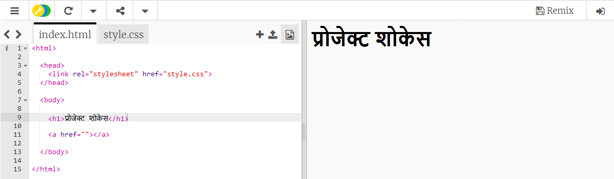
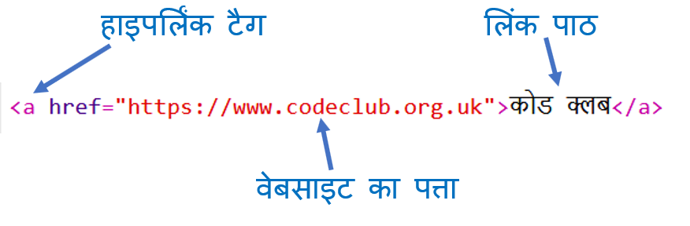
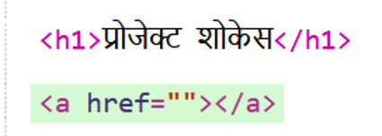
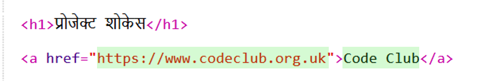
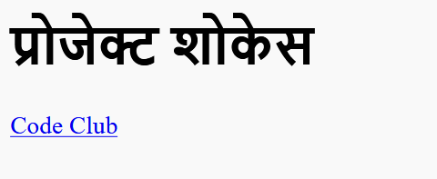
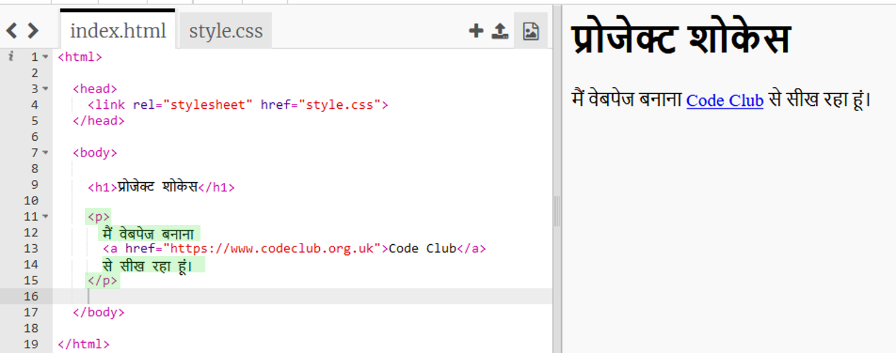

## वेब पेजों में लिंक जोड़ना

पाठ लिंक आपको दूसरे वेब पेज पर जाने के लिए शब्दों पर क्लिक करने की अनुमति देता है; वे आमतौर पर रेखांकित होते हैं।

+ इस trincket को खोलें: [jumpto.cc/web-showcase](http://jumpto.cc/web-showcase).
    
    यह परियोजना इस तरह दिखनी चाहिए:
    
    

+ HTML में `<a>` टैग लिंक्स के लिए इस्तेमाल किया जाता हैं।

+ अपने परियोजना में `<a>` टैग को ढूंढे 

+ कोड क्लब वेबसाइट का पता [` https://www.codeclub.org.uk `](https://www.codeclub.org.uk) और लिंक पाठ जोड़ें:

+ अपने trinket का परीक्षण करने के लिए 'run' (चलाएँ) पर क्लिक करें।

+ अपने वेबपृष्ठ का परीक्षण करने के लिए Code Club लिंक पर क्लिक करें। आपका trinket अब Code Club वेबपेज दिखाएगा: 

+ अपने पृष्ठ पर वापस जाने के लिए आप या तो:
    
    + अपना trinket फिर से चलाएं,
    
    + Tap the Backspace key on the keyboard, or
    
    + Right-click and choose Back.

+ Now put your link into a sentence inside a paragraph:

Test your webpage.