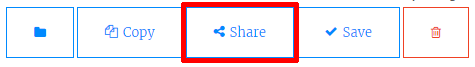

## Trinket से लिंक करें

आप एक trinket के वेब पृष्ठ से लिंक कर सकते हैं।

+ क्या आपने अपने जन्मदिन मुबारक ट्रिंकेट का लिंक रखा है? यदि आपने रखा है तो उस trinket को दूसरे ब्राउज़र टैब या विंडो में खोलें। अन्यथा तैयार उदाहरण trinket खोलें: <https://trinket.io/html/e996dc0380>

+ अपने ट्रिंकेट के ऊपर Share मेनू पर क्लिक करें और Link चुनें:

यदि आपने अपने खाते से trinket खोला है, तो इसके बजाय अपने trinket के ऊपर Share ऑप्शन को खोजें:

+ 'Only show code or result (let users toggle between them)' चुने और लिंक को trinket में कॉपी करें। 

+ अपने प्रोजेक्ट शोकेस Trinket पर वापस जाएं और `<h2>` शीर्षक और अपने जन्मदिन मुबारक प्रोजेक्ट का लिंक जोड़ें।

अपने वेब पृष्ठ का परीक्षण करें; वह कुछ इस तरह दिखना चाहिए:

परीक्षण करने के लिए जन्मदिन मुबारक लिंक पर क्लिक करें कि यह आपको trinket पर ले जाता है।