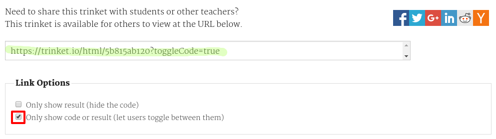

## Trinket से लिंक करें

आप एक trinket के लिए वेब पेज से लिंक कर सकते हैं।

+ क्या आपने अपने हैप्पी बर्थडे trinket का लिंक रखा है? यदि आपने किया है तो उस trinket को दूसरे ब्राउज़र टैब या विंडो में खोलें। Otherwise open the finished example trinket: <https://trinket.io/html/e996dc0380>

+ Click on the Share menu above your trinket and choose Link:

If you opened the trinket from your account then look for the Share option above your trinket instead:

+ Choose 'Only show code or result (let users toggle between them)' and copy the link to the trinket. 

+ Go back to your Project Showcase trinket and add an `<h2>` heading and a link to your Happy Birthday Project.

Test your webpage; it should look something like this:

Click the Happy Birthday link to test that it takes you to the trinket.