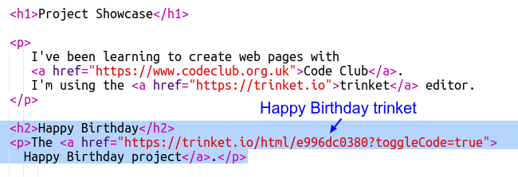

## ट्रिंकेट से लिंक करें

आप एक ट्रिंकेट के लिए वेब पेज से लिंक कर सकते हैं।

+ क्या आपने अपने जन्मदिन मुबारक ट्रिंकेट का लिंक रखा है? यदि आपने किया है तो उस ट्रिंकेट को दूसरे ब्राउज़र टैब या विंडो में खोलें। अन्यथा समाप्त उदाहरण ट्रिंकेट खोलें: <https://trinket.io/html/e996dc0380>

+ अपनी ट्रिंकेट के ऊपर स्थित शेयर मेनू पर क्लिक करें और लिंक चुनें:

यदि आपने अपने खाते से Trinket खोला है, तो इसके बजाय अपने Trinket के ऊपर शेयर विकल्प को खोजें:

+ 'Only show code or result (let users toggle between them)' चुने और लिंक को Trinket में कॉपी करें। 

+ अपने प्रोजेक्ट शोकेस Trinket पर वापस जाएं और `<h2>` शीर्षक और अपने जन्मदिन मुबारक परियोजना का लिंक जोड़ें।

अपने वेब पेज का परीक्षण करें; वह कुछ इस तरह दिखना चाहिए:

परीक्षण करने के लिए जन्मदिन मुबारक लिंक पर क्लिक करें जो आपको Trinket पर ले जाता है।