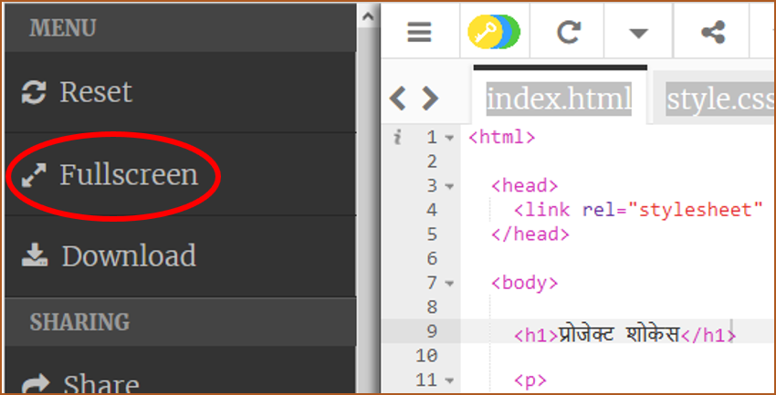
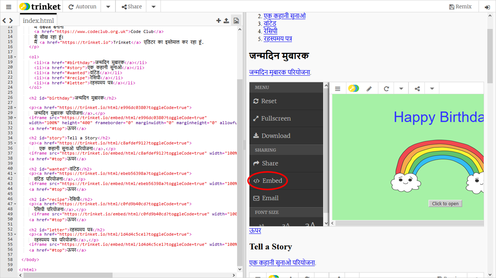
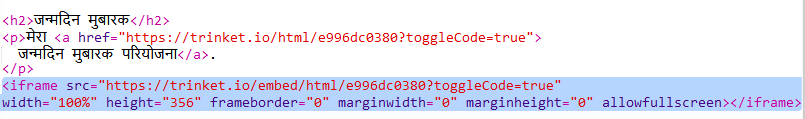
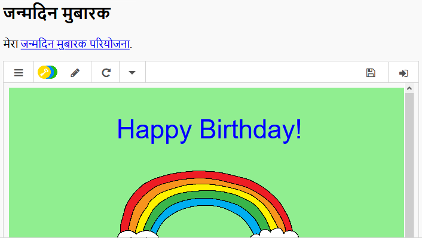
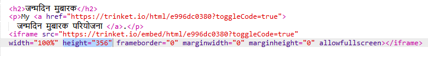
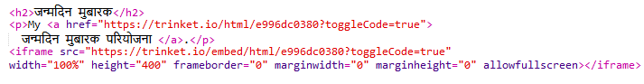

## प्रोजेक्ट्स को एम्बेड करना

Trinket को वेब पृष्ठ के रूप में जोड़ने के साथ-साथ हम उन्हें एक वेब पृष्ठ में एम्बेड भी कर सकते हैं।

+ आप फुलस्क्रीन मोड में काम करने की कोशिश कर सकते हैं ताकि आपके पास अधिक जगह हो:

फुलस्क्रीन मोड से बाहर निकलने के लिए Esc दबाएं।

+ अपना Trinket Run करें और "जन्मदिन मुबारक" लिंक पर क्लिक करें।

+ Trinket मेन्यू पर क्लिक करें और **embed** चुनें। यदि आप फ़ुलस्क्रीन मोड में नहीं हैं, तो आपको स्क्रॉल करना पड़ सकता है। कीबोर्ड पर नीचे तीर जैसा बटन या दाईं ओर पर स्क्रॉल पट्टी का उपयोग करें।

+ 'Only show code or result (let users toggle between them)' चुनें और Trinket के लिए एम्बेड कोड को **कॉपी** करें। 

+ Trinket ने आपके वेब पृष्ठ में शामिल करने के लिए कुछ HTML बनाया है। यह एक `<iframe>` टैग का उपयोग करता है जो सामग्री को एक पृष्ठ के भीतर एम्बेड करने की अनुमति देता है।

+ अब उस कोड को "जन्मदिन मुबारक" trinket के लिंक के नीचे पेस्ट करें:

+ इसका परीक्षण करने के लिए अपना Trinket चलाएं और आपको प्रोजेक्ट में एम्बेडेड जन्मदिन मुबारक प्रोजेक्ट दिखना चाहिए। 

+ आप पा सकते हैं कि आपके trinket का निचला भाग प्रदर्शित नहीं होता है। आप `<iframe>` पर height (ऊंचाई) मान बदलकर इसे ठीक कर सकते हैं। 

height (ऊंचाई) को **400** पर सेट करें। यदि आपने "जन्मदिन मुबारक" प्रोजेक्ट में बदलाव किए हैं तो आपको एक अलग मूल्य चुनने की आवश्यकता हो सकती है।

