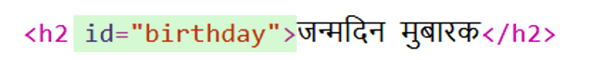
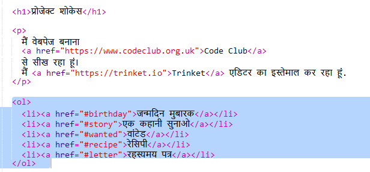
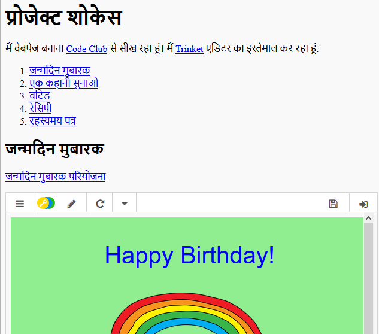

## विषयों की सूची बनाएँ

आइए विषयों की सूची जोड़ें, ताकि हम आसानी से प्रत्येक प्रोजेक्ट पर पहुँच सकें।

+ अन्य वेब पृष्ठों से लिंक करने में सक्षम होने के साथ-साथ, हम वेब पृष्ठ के कुछ हिस्सों से लिंक कर सकते हैं यदि हम उन्हें एक आईडी देते हैं। 

"जन्मदिन मुबारक" प्रोजेक्ट के लिए `<h2>` शीर्षक में एक आईडी जोड़ें:

+ अपने प्रत्येक प्रोजेक्ट में आईडी जोड़ें और उन्हें संक्षिप्त नाम दें: story, wanted, recipe और letter।

+ आप एक एलिमेंट के साथ एक आईडी लिंक कर सकते हैं उसके नाम के आगे हैश '#' चिह्न लगाकर। उदाहरण के लिए, `#birthday`।

अपने प्रोजेक्ट्स के लिंक्स की एक क्रमबद्ध सूची बनाएं। (क्रमबद्ध सूचियाँ रेसिपी परियोजना में प्रस्तुत की गई हैं।)

+ अपने प्रोजेक्ट को चलाएं और अपने प्रोजेक्ट्स पर जाने के लिए लिंक पर क्लिक करके इसका परीक्षण करें। 

