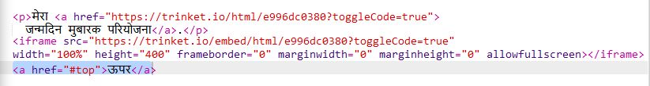
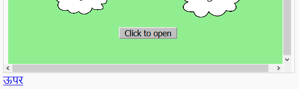

## शीर्ष पर वापस जाना

+ पेज के शीर्ष पर वापस जाने के लिए नेविगेट करने में सक्षम होना भी उपयोगी होता है। इस प्रयोजन के लिए HTML में `#top` शामिल होता है। 

+ अपने वेबपेज में एम्बेड किए गए प्रत्येक प्रोजेक्ट के बाद `#top` के लिए लिंक जोड़ें:

+ पेज के शीर्ष पर वापस जाने के लिए टॉप पर क्लिक करके अपने लिंक्स का परीक्षण करें। 

