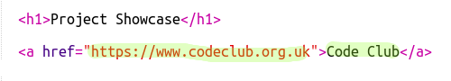

## Menambahkan Tautan ke Halaman Web

Tautan teks memungkinkan Anda mengeklik kata untuk membuka halaman web lain; mereka biasanya digarisbawahi.

+ Buka trinket ini: [jumpto.cc/web-showcase](http://jumpto.cc/web-showcase).
    
    Proyek akan terlihat seperti ini:
    
    

+ HTML menggunakan tag `<a>` untuk tautan.

+ Temukan tag `<a>` di proyek Anda. 

+ Tambahkan alamat situs web Kode Klub [`https://www.codeclub.org.uk`](https://www.codeclub.org.uk) dan teks tautan:

+ Klik Run untuk menguji trinket Anda.

+ Klik pada tautan Code Club untuk menguji halaman web Anda. Trinket Anda sekarang akan menampilkan halaman web Code Club: 

+ Untuk kembali ke halaman Anda, Anda dapat:
    
    + Jalankan lagi trinket Anda,
    
    + Ketuk tombol Backspace pada keyboard, atau
    
    + Klik kanan dan pilih Kembali.

+ Sekarang letakkan tautan Anda ke dalam kalimat di dalam paragraf:

Uji halaman web Anda.