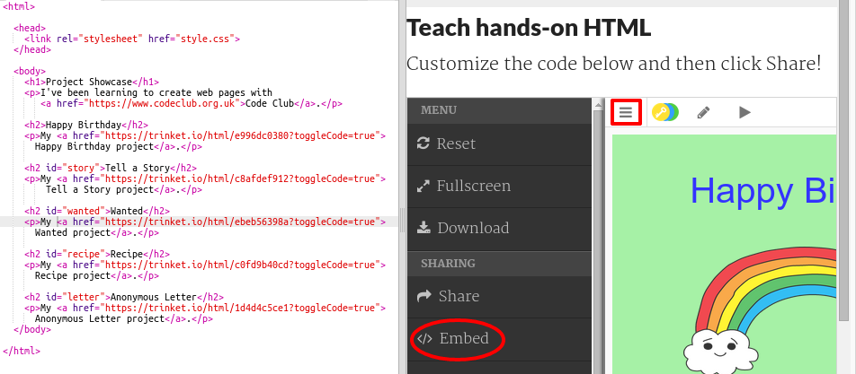

## Menyematkan Proyek

Serta menghubungkan ke pernak-pernik sebagai halaman web kami juga dapat menanamkan mereka di halaman web.

+ Anda mungkin ingin mencoba bekerja dalam mode Layar Penuh sehingga Anda memiliki lebih banyak ruang:

Tekan Esc untuk keluar dari mode Layar Penuh.

+ Jalankan trinket Anda dan klik tautan Selamat Ulang Tahun.

+ Klik pada menu trinket dan pilih **embed**. Jika Anda tidak dalam mode Layar Penuh, Anda mungkin harus menggulir. Gunakan bilah gulir di sebelah kanan atau panah ke bawah pada keyboard.

+ Pilih 'Hanya tampilkan kode atau hasil (biarkan pengguna beralih di antara mereka)' dan **salin** kode embed untuk trinket. 

+ Trinket telah membuat beberapa HTML untuk Anda sertakan di halaman web Anda. Ini menggunakan tag `<iframe>` yang memungkinkan konten untuk disematkan dalam satu halaman.

+ Sekarang tempelkan kode itu di bawah tautan ke trinket Selamat Ulang Tahun:

+ Jalankan trinket Anda untuk mengujinya dan Anda akan melihat proyek Selamat Ulang Tahun Anda tertanam di halaman web. 

+ Anda mungkin menemukan bahwa bagian bawah trinket Anda tidak ditampilkan. Anda dapat memperbaikinya dengan mengubah nilai ketinggian pada `<iframe>`. 

Setel tinggi ke **400**. Jika Anda membuat perubahan pada proyek Happy Birthday, Anda mungkin perlu memilih nilai yang berbeda.

