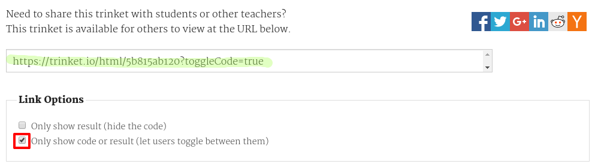

## Link a un trinket

Puoi collegare la pagina web con un trinket.  

+ Hai salvato il link del trinket Buon compleanno? Se lo hai fatto, apri il trinket in un’altra scheda o finestra del browser. Altrimenti, apri il trinket di esempio già finito: <a href="https://trinket.io/html/e996dc0380">https://trinket.io/html/e996dc0380</a>

Fai clic sul menu Share (condividi) nella parte superiore dello schermo e scegli Link:

Se hai aperto il trinket dal tuo account, cerca l’opzione Share che si trova sotto il trinket:

+ Seleziona "Only show code or result (let users toggle between them)" che significa "Mostra solo il codice o il risultato (permettere agli utenti di alternare tra i due)" e copia il link del trinket.

+ Torna al trinket Presentazione dei progetti e aggiungi un’intestazione <h2> e un link al tuo progetto Buon compleanno.

Prova la pagina web; dovrebbe avere questo aspetto:

Fai clic sul link Buon compleanno per provare se porta al trinket.

