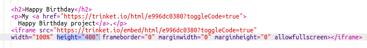

## Inserire progetti

Oltre a collegare i trinket come pagine web, possiamo anche inserirli in una pagina web.

+ Magari preferisci provare a lavorare in modalità schermo intero per avere più spazio:

Premi il tasto Esc (escape) per uscire dalla modalità schermo intero.

+ Esegui il trinket e fai clic sul link Buon compleanno.

+ Fai clic sul menu trinket e seleziona __embed__(inserisci). Se non sei in modalità schermo intero, è possibile che tu debba scorrere. Usa la barra di scorrimento sulla destra oppure la freccia giù sulla tastiera.

+ Seleziona "Only show code or result (let users toggle between them)" che significa "Mostra solo il codice o il risultato (permettere agli utenti di alternare tra i due)" e __copia__ il codice inserito per il trinket.

+ Il trinket ha creato un HTML perché tu lo includa nella pagina web. Utilizza un tag `<iframe>` che consente l’inserimento del contenuto in una pagina.

+ Ora incolla il codice sotto il link del trinket Buon compleanno:

+ Esegui il trinket per provarlo. Dovresti vedere il progetto Buon compleanno inserito nella pagina web.

+ È possibile che la parte inferiore del trinket non si veda. Puoi correggere modificando il valore dell’altezza (height) su `<iframe>`.

Impostare l’altezza a __400__. Se hai effettuato delle modifiche al progetto Buon compleanno, è possibile che debba scegliere un valore diverso.

