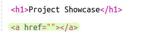
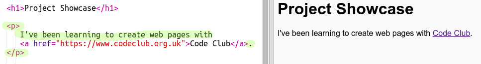

## ವೆಬ್‌ಪುಟಗಳಿಗೆ ಲಿಂಕ್‌ಗಳನ್ನು ಸೇರಿಸಲಾಗುತ್ತಿದೆ

ಪಠ್ಯ ಲಿಂಕ್‌ಗಳು ಮತ್ತೊಂದು ವೆಬ್ ಪುಟಕ್ಕೆ ಹೋಗಲು ಪದಗಳ ಮೇಲೆ ಕ್ಲಿಕ್ ಮಾಡಲು ನಿಮಗೆ ಅನುಮತಿಸುತ್ತದೆ; ಅವುಗಳನ್ನು ಸಾಮಾನ್ಯವಾಗಿ ಅಂಡರ್ಲೈನ್ ಮಾಡಲಾಗುತ್ತದೆ.

+ ಈ ಟ್ರಿಂಕೆಟ್ ತೆರೆಯಿರಿ: [ jumpto.cc/web-showcase ](http://jumpto.cc/web-showcase) .
    
    ಯೋಜನೆಯು ಈ ರೀತಿ ಕಾಣಿಸಬೇಕು:
    
    

+ HTML ಲಿಂಕ್‌ಗಳಿಗಾಗಿ `<a>` ಟ್ಯಾಗ್ ಅನ್ನು ಬಳಸುತ್ತದೆ.

+ ನಿಮ್ಮ ಯೋಜನೆಯಲ್ಲಿ `<a>` ಟ್ಯಾಗ್ ಹುಡುಕಿ. 

+ ಕೋಡ್ ಕ್ಲಬ್ ವೆಬ್‌ಸೈಟ್ ವಿಳಾಸ [` https://www.codeclub.org.uk ಅನ್ನು ಸೇರಿಸಿ `](https://www.codeclub.org.uk) ಮತ್ತು ಲಿಂಕ್ ಪಠ್ಯ:

+ ನಿಮ್ಮ ಟ್ರಿಂಕೆಟ್ ಅನ್ನು ಪರೀಕ್ಷಿಸಲು ರನ್ ಕ್ಲಿಕ್ ಮಾಡಿ.

+ ನಿಮ್ಮ ವೆಬ್‌ಪುಟವನ್ನು ಪರೀಕ್ಷಿಸಲು ಕೋಡ್ ಕ್ಲಬ್ ಲಿಂಕ್ ಅನ್ನು ಕ್ಲಿಕ್ ಮಾಡಿ. ನಿಮ್ಮ ಟ್ರಿಂಕೆಟ್ ಈಗ ಕೋಡ್ ಕ್ಲಬ್ ವೆಬ್‌ಪುಟವನ್ನು ತೋರಿಸುತ್ತದೆ: 

+ ನಿಮ್ಮ ಪುಟಕ್ಕೆ ಹಿಂತಿರುಗಲು ನೀವು ಹೀಗೆ ಮಾಡಬಹುದು:
    
    + ನಿಮ್ಮ ಟ್ರಿಂಕೆಟ್ ಅನ್ನು ಮತ್ತೆ ಚಲಾಯಿಸಿ,
    
    + ಕೀಬೋರ್ಡ್‌ನಲ್ಲಿ ಬ್ಯಾಕ್‌ಸ್ಪೇಸ್ ಕೀಲಿಯನ್ನು ಟ್ಯಾಪ್ ಮಾಡಿ, ಅಥವಾ
    
    + ಬಲ ಕ್ಲಿಕ್ ಮಾಡಿ ಮತ್ತು ಹಿಂತಿರುಗಿ ಆಯ್ಕೆಮಾಡಿ.

+ ಈಗ ನಿಮ್ಮ ಲಿಂಕ್ ಅನ್ನು ಪ್ಯಾರಾಗ್ರಾಫ್ ಒಳಗೆ ಒಂದು ವಾಕ್ಯಕ್ಕೆ ಇರಿಸಿ:

ನಿಮ್ಮ ವೆಬ್‌ಪುಟವನ್ನು ಪರೀಕ್ಷಿಸಿ.