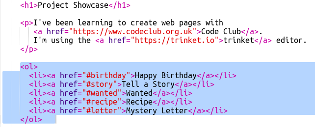

## ಪರಿವಿಡಿ ರಚಿಸಿ

ಪರಿವಿಡಿಯನ್ನು ಸೇರಿಸೋಣ ಆದ್ದರಿಂದ ನಾವು ಪ್ರತಿ ಯೋಜನೆಗೆ ಸುಲಭವಾಗಿ ಹೋಗಬಹುದು.

+ ಇತರ ವೆಬ್‌ಪುಟಗಳಿಗೆ ಲಿಂಕ್ ಮಾಡಲು ಸಾಧ್ಯವಾಗುವುದರ ಜೊತೆಗೆ, ನಾವು ಅವರಿಗೆ ಐಡಿ ನೀಡಿದರೆ ವೆಬ್‌ಪುಟದ ಭಾಗಗಳಿಗೆ ಲಿಂಕ್ ಮಾಡಬಹುದು. 

ಜನ್ಮದಿನದ ಶುಭಾಶಯಗಳ ಯೋಜನೆಗೆ `<h2>` ಶೀರ್ಷಿಕೆಗೆ ಐಡಿ ಸೇರಿಸಿ:

+ ನಿಮ್ಮ ಪ್ರತಿಯೊಂದು ಯೋಜನೆಗಳಿಗೆ ಐಡಿಗಳನ್ನು ಸೇರಿಸಿ ಮತ್ತು ಅವರಿಗೆ ಸಣ್ಣ ಹೆಸರುಗಳನ್ನು ನೀಡಿ: ಕಥೆ, ಬೇಕಾದ, ಪಾಕವಿಧಾನ ಮತ್ತು ಪತ್ರ.

+ ಹ್ಯಾಶ್ '#' ಚಿಹ್ನೆಯನ್ನು ಅದರ ಹೆಸರಿನ ಮುಂದೆ ಇರಿಸುವ ಮೂಲಕ ನೀವು ಐಡಿಯೊಂದಿಗೆ ಅಂಶಕ್ಕೆ ಲಿಂಕ್ ಮಾಡಬಹುದು. ಉದಾಹರಣೆಗೆ, ` # ಜನ್ಮದಿನ ` .

ನಿಮ್ಮ ಯೋಜನೆಗಳಿಗೆ ಲಿಂಕ್‌ಗಳ ಆದೇಶ ಪಟ್ಟಿಯನ್ನು ರಚಿಸಿ. (ಪಾಕವಿಧಾನ ಯೋಜನೆಯಲ್ಲಿ ಆದೇಶ ಪಟ್ಟಿಗಳನ್ನು ಪರಿಚಯಿಸಲಾಗಿದೆ.)

+ ನಿಮ್ಮ ಪ್ರಾಜೆಕ್ಟ್‌ಗಳಿಗೆ ತೆರಳಲು ಲಿಂಕ್‌ಗಳನ್ನು ಕ್ಲಿಕ್ ಮಾಡುವುದರ ಮೂಲಕ ನಿಮ್ಮ ಪ್ರಾಜೆಕ್ಟ್ ಅನ್ನು ಚಲಾಯಿಸಿ ಮತ್ತು ಅದನ್ನು ಪರೀಕ್ಷಿಸಿ. 

