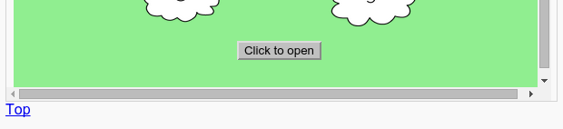

## ಮೇಲಕ್ಕೆ ಹಿಂತಿರುಗುವುದು

+ ಪುಟದ ಮೇಲ್ಭಾಗಕ್ಕೆ ಹಿಂತಿರುಗಲು ಸಹ ಇದು ಉಪಯುಕ್ತವಾಗಿದೆ. HTML ` # ಟಾಪ್ ಹೊಂದಿದೆ ` ಈ ಕಾರಣಕ್ಕಾಗಿ.

+ ` # ಟಾಪ್‌ಗೆ ಲಿಂಕ್ ಸೇರಿಸಿ ` ನಿಮ್ಮ ವೆಬ್‌ಪುಟದಲ್ಲಿ ಪ್ರತಿ ಎಂಬೆಡೆಡ್ ಯೋಜನೆಯ ನಂತರ:

+ ಪುಟದ ಮೇಲ್ಭಾಗಕ್ಕೆ ಹಿಂತಿರುಗಲು ಟಾಪ್ ಕ್ಲಿಕ್ ಮಾಡುವ ಮೂಲಕ ನಿಮ್ಮ ಲಿಂಕ್‌ಗಳನ್ನು ಪರೀಕ್ಷಿಸಿ.