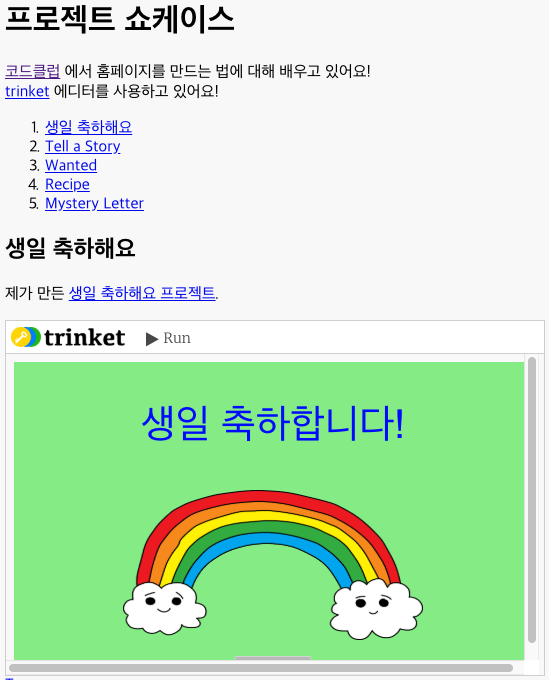

## 소개

이 프로젝트에서 HTML프로젝트의 쇼케이스를 만들어 보고, 링크와 임베딩에 대한 개념을 배울 것입니다.

### 교육자들을 위한 추가 정보

이 프로젝트를 인쇄하려면 [프린트용 문서](https://projects.raspberrypi.org/en/projects/project-showcase/print)를 사용하십시오.

## \--- collapse \---

## title: 교육자들을 위한 메모

## 들어가며:

이 프로젝트에서 학생들은 웹 페이지에서의 하이퍼링크와 trinket에 Scratch 프로젝트를 임베딩하는 법에 대해 배울 것입니다.

## 온라인 자료들

이 자료에서는 [Trinket](https://trinket.io/)을 사용하여 HTML & CSS를 온라인으로 편집할 것을 권장합니다. 이 프로젝트에 포함된 Trinket은 다음과 같습니다:

* ['프로젝트 쇼케이스' 시작점 -- jumpto.cc/web-showcase](http://jumpto.cc/web-showcase)

학생들은 새로운 Trinket[(jumpto.cc/html-black)](http://jumpto.cc/html-blank)을 사용할 수 있으며, 이를 통해 자신만의 HTML & CSS 코드를 작성하는 법을 배울 수 있습니다. 또한, 템플릿이 제공되어 있는 Trinket을 사용할 수 있습니다. [(jumpto.cc/html-template)](http://jumpto.cc/html-template).

프로젝트의 샘플 정답이 다음 Trinket에 있습니다.

* ['프로젝트 쇼케이스 완성본' -- trinket.io/html/5b815ab120](https://trinket.io/html/5b815ab120)

## 오프라인 자료들

여러분의 선호에 따라 프로젝트를 [오프라인에서 완성](https://www.codeclubprojects.org/en-GB/resources/webdev-working-offline/)할 수 있습니다. 'Project Materials' 라는 링크를 클릭하여 이 프로젝트의 자료를 확인해볼 수 있습니다. 이 링크에는 학생들이 프로젝트를 오프라인으로 완료하는 데 필요한 자료가 포함된 'Project Resource' 섹션이 있습니다. 학생들이 이러한 자료의 사본에 접근할 수 있는지 확인하십시오. 이 섹션에는 아래와 같은 파일들이 포함되어 있습니다.

* project-showcase/index.html
* project-showcase/style.css
* template/template.html
* template/style.css

이 프로젝트의 완성된 버전은 'Volunteer Resources' 섹션에서 찾을 수 있습니다. 다음 파일이 있습니다:

* project-showcse-finished/index.html
* project-showcse-finished/style.css

(또한 위의 모든 자료는 프로젝트 및 자원봉사자 `.zip` 파일로 다운로드 할 수 있습니다.)

학생들이 이 프로젝트를 오프라인에서 완수한 경우, 작품을 embed 하는 기능을 사용할 순 없지만, 대신 해당 프로젝트에 링크를 걸 수 있음을 알아 두십시오.

## 학습 목표

* 이 프로젝트는 링크를 사용하여 다른 웹페이지와 웹페이지를 연결하고, id를 부여하는 방법에 대해 소개합니다. 또한 Trinket 프로젝트와 Scratch 프로젝트를 학생들의 웹페이지에 임베딩하는 방법 또한 배웁니다. 

이 프로젝트는 [라즈베리파이 디지털 메이킹 커리큘럼](http://rpf.io/curriculum) 중 아래의 과정에 있는 요소들을 다룹니다.

* [2D와 3D 디자인](https://www.raspberrypi.org/curriculum/design/creator)

## 도전과제

* "새로운 링크 추가" - 여러 웹페이지에 링크 추가
* "프로젝트 리스트 추가" - 전에 만든 웹 프로젝트 링크 추가
* "더 많은 프로젝트 임베딩" - CSS를 이용하여 새로운 스타일 제작

\--- /collapse \---

## \--- collapse \---

## title: 프로젝트 자료

## 프로젝트 리소스

* [모든 프로젝트 자료가 들어있는 .zip 파일](resources/showcase-project-resources.zip)
* [모든 프로젝트 쇼케이스 자료가 포함된 온라인 Trinket](http://jumpto.cc/web-showcase)
* [온라인 Trinket 템플릿](http://jumpto.cc/trinket-template)
* [온라인 빈 템플릿](http://jumpto.cc/trinket-blank)
* [template/index.html](resources/template-index.html)
* [template/style.css](resources/template-style.css)
* [project-showcase/index.html](resources/project-showcase-index.html)
* [project-showcase/style.css](resources/project-showcase-style.css)

## 교육자를 위한 자료

* [완성된 모든 프로젝트 리소스가 들어있는 .zip 파일](resources/showcase-volunteer-resources.zip)
* [완성된 온라인 Trinket 프로젝트](https://trinket.io/html/1d4d4c5ce1)
* [project-showcse-finished/index.html](resources/project-showcase-finished-index.html)
* [project-showcse-finished/style.css](resources/project-showcase-finished-style.css)

-- /collapse \---