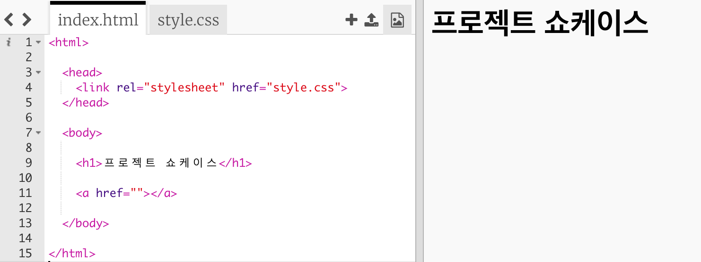
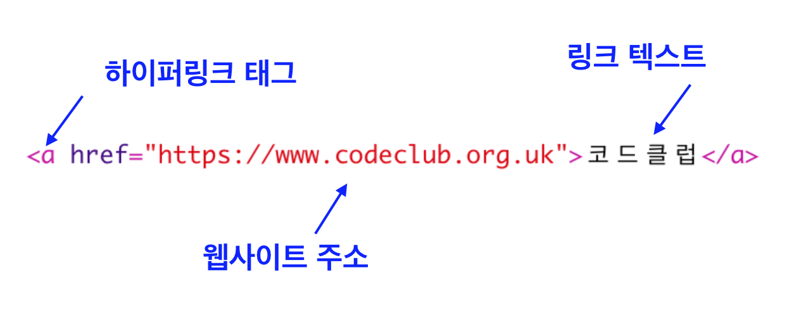
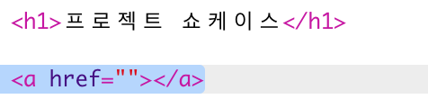
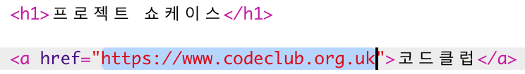
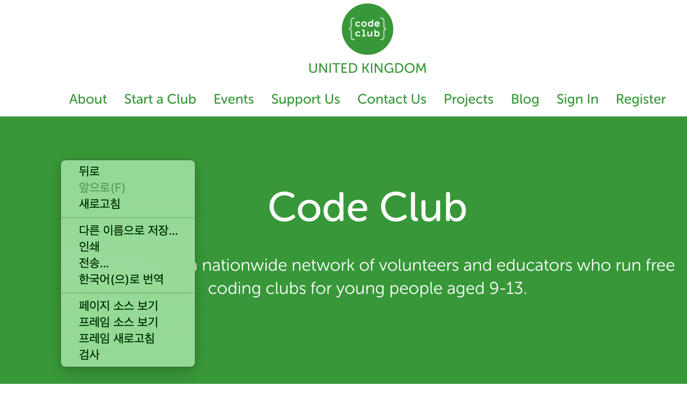
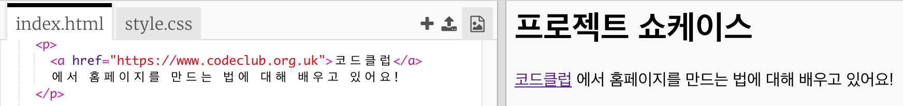

## 웹페이지에 링크 추가하기

하이퍼링크는 단어를 클릭하면 다른 페이지로 이동할 수 있도록 해 줍니다; 주로 밑줄이 그어져 있습니다.

+ 다음 Trinket 파일을 열어주세요: [jumpto.cc/web-showcase](http://jumpto.cc/web-showcase).
    
    프로젝트는 아래와 같이 보일 것입니다:
    
    

+ HTML은 링크주소를 쓸 때 `<a>` 태그를 사용합니다.

+ 프로젝트에서 `<a>` 태그를 찾아 보세요. 

+ 코드클럽 웹사이트 주소를 추가하세요. [`https://codeclub.org.uk`](https://www.codeclub.org.uk)와 연결문

+ Run을 눌러 자신이 만든 Trinket을 테스트해보세요.

+ 코드클럽 링크를 눌러 제작한 웹 페이지를 테스트 해 보세요. 코드클럽 링크를 누르면 아래와 같이 코드클럽 웹페이지가 뜹니다. 

+ 아래와 같은 방법으로 페이지를 빠져나갈 수 있습니다.
    
    + Trinket 재실행
    
    + Backspace 키를 키보드에서 누르거나
    
    + 오른쪽 버튼을 눌러 뒤로가기 버튼을 누르세요.

+ 단락의 문장에 링크를 추가해 봅시다.

웹페이지를 테스트해 보세요.