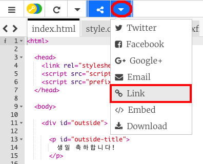
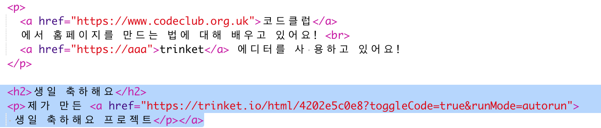
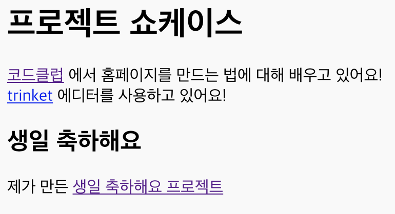

## Trinket 링크 걸기

웹페이지에 Trinket을 연결할 수 있습니다.

+ '생일 축하' Trinket의 링크를 가지고 있나요? 만약 그렇다면 그 Trinket을 다른 탭이나 창에서 열어보세요. 아니면 완성된예제 Trinket을 사용하셔도 됩니다. <https://trinket.io/html/e996dc0380>

+ Trinket 위에 있는 공유 메뉴를 클릭하고 링크를 선택하십시오.

If you opened the trinket from your account then look for the Share option above your trinket instead:

+ 'Only show code or result (let users toggle between them)' 을 선택하여, 링크를 Trinket에 복사하십시오. 

+ 프로젝트 쇼케이스 Trinket으로 돌아가 `<h2>` 태그를 추가하고, '생일 축하해요' 프로젝트 링크를 추가하십시오.

아래와 같이 실행될 것입니다.

'생일 축하' 링크를 클릭하여 Trinket으로 이동하는지 테스트 해보세요.