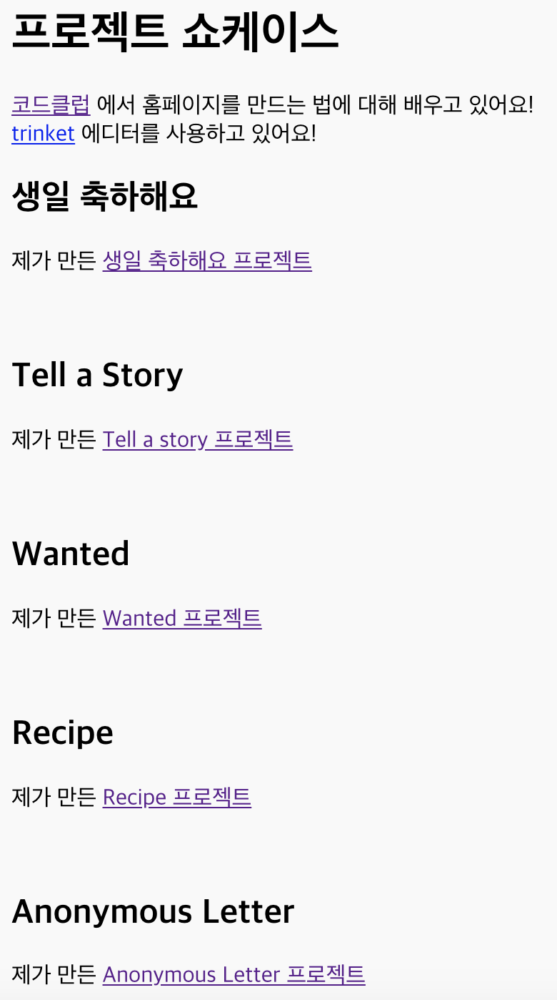

--- challenge ---

## 과제: 프로젝트 리스트 만들기

코드클럽에서 제작한 HTML & CSS 예제를 더 추가해 봅시다. 웹페이지를 연결하려면 `<h2>` 태그를 사용합니다.

작성한 프로젝트에 대한 링크가 없는 경우 Code Club 예제를 사용하십시오. (영어 버전)

+ Happy Birthday: <https://trinket.io/html/ea67e3f80a>

+ Tell a Story: <https://trinket.io/html/c8afdef912>

+ Wanted: <https://trinket.io/html/ebeb56398a>

+ Recipe: <https://trinket.io/html/c0fd9b40cd>

+ Mystery Letter: <https://trinket.io/html/1d4d4c5ce1>

완성된 페이지는 아래와 같습니다.

--- /challenge ---