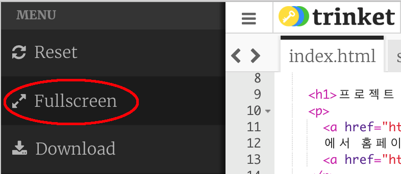
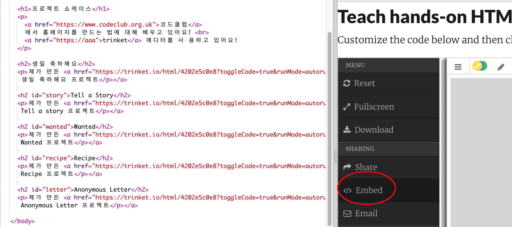
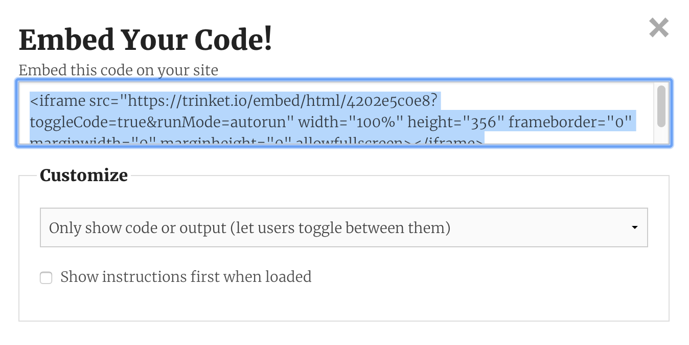
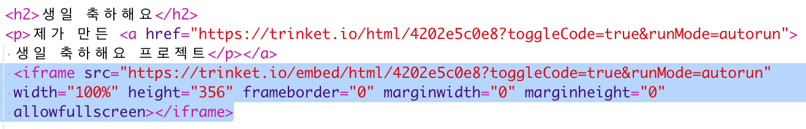
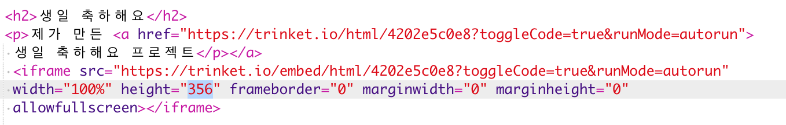
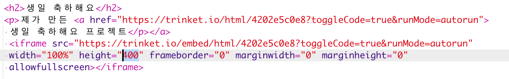

## 프로젝트 임베딩

Trinket에 웹페이지에 링크를 걸 수 있듯이, 아예 웹페이지를 임베딩할 수 있습니다.

+ 더 넓은 화면이 필요하다면 전체 화면 모드에서 작업하세요.

전체 화면을 끝내려면 ESC 키를 누르세요.

+ Trinket을 실행해서 '생일 축하해요' 링크를 클릭하세요.

+ Trinket 메뉴에서 **embed**을 선택합니다. 전체 화면 모드가 아니라면 스크롤해야 합니다. 오른쪽의 스크롤 막대 또는 키보드의 아래쪽 화살표를 사용하십시오.

+ 'Only show code or result (let users toggle between them)' 을 선택하여, embed 코드를 **복사**하십시오. 

+ Trinket은 당신의 웹페이지에 포함할 수 있도록 HTML을 만들었다. `<iframe>` 태그로 페이지를 임베딩할 수 있습니다.

+ 이 코드를 생일 축하 Trinket 링크 아래에 붙여넣기 합니다.

+ Trinket을 실행하여, 웹페이지에 임베드된 '생일 축하해요' 프로젝트가 정상적으로 로딩되었는지 확인해 보세요. 

+ Trinket의 밑부분이 표시되지 않았다는 것을 발견할 것입니다. `<iframe>`의 height 값을 수정하는 것으로 문제를 해결할 수 있습니다. 

height를 **400**으로 변경합니다. 생일 축하 프로젝트를 변경한 경우 다른 값을 선택해야 할 수도 있습니다.

