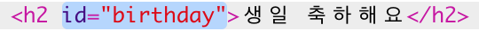
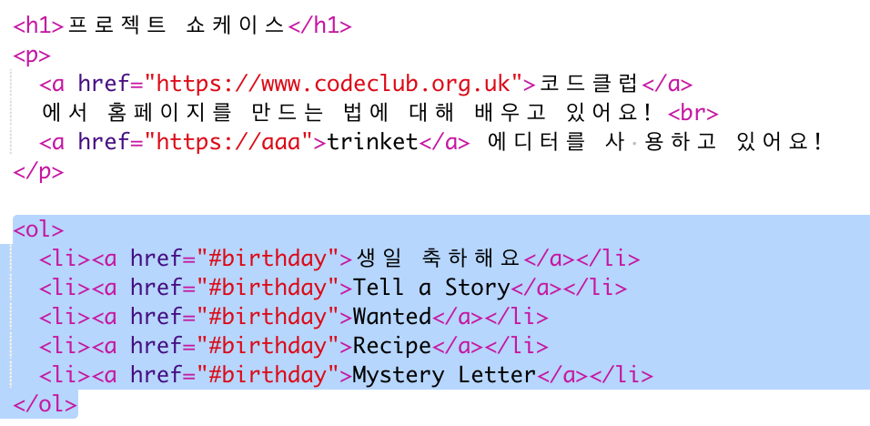
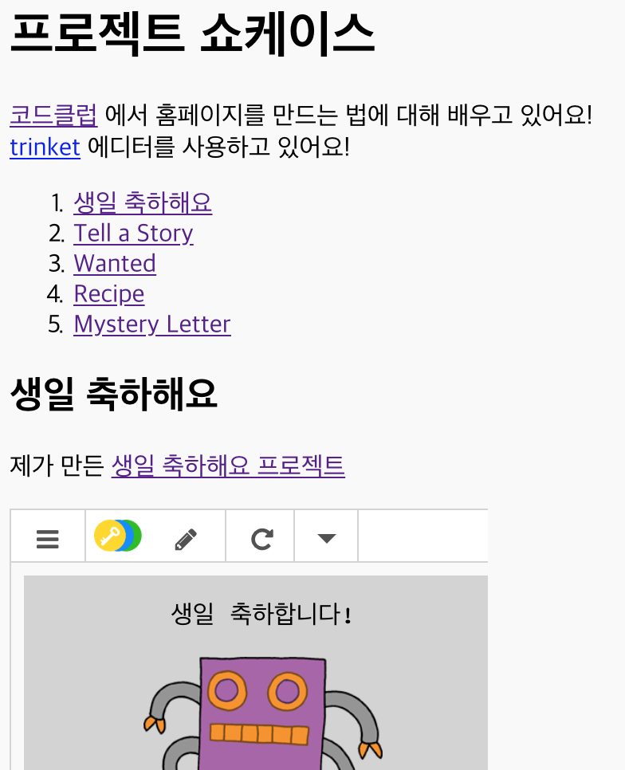

## 목차 추가하기

목차를 추가하여 쉽게 프로젝트를 찾을 수 있도록 합시다.

+ 다른 웹페이지에 연결할 수 있을 뿐만 아니라, iD를 부여하면 웹페이지의 일부분에 연결할 수 있습니다. 

'생일 축하해요' 프로젝트의 `<h2>` 부분에 id를 추가하세요.

+ 각 프로젝트에 간단한 id를 부여하세요: story, wanted, recipe 등...

+ 링크 앞에 '#'을 추가하는 것으로 페이지 내 id로 이동할 수 있습니다. 예로, `#birthday` 등을 사용할 수 있습니다.

프로젝트에 대한 링크의 정렬된 목록을 만들어 보세요. (정렬된 리스트는 Recipe 프로젝트에 소개되어 있습니다.)

+ 프로젝트로 이동할 링크를 클릭하여 프로젝트를 실행하고 테스트해 보세요. 

