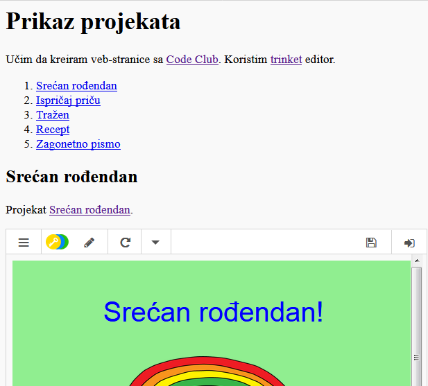

## Uvod

U ovom projektu napravićeš prikaz svojih HTML projekata i učiti o linkovima i ugrađivanju izvora.

### Dodatne informacije za vođe kluba

Ukoliko je potrebno da odštampate ovaj projekat, koristite [Verziju za štampu](https://projects.raspberrypi.org/me-ME/projects/project-showcase/print).

--- collapse ---
---
title: Bilješke za vođe kluba
---
## Uvod:

U ovom projektu djeca se upoznaju sa hiperlinkovima i sa ugrađivanjem trinketa i Scratch projekata na veb-stranicu.

## Online izvori

Za pisanje HTML-a i CSS-a online preporučujemo da koristite [trinket](https://trinket.io/). Ovaj projekat sadrži sljedeći trinket:

* [Početak projekta 'Prikaz projekata' -- trinket.io/html/f21c322376](http://trinket.io/html/f21c322376)

Za pisanje sopstvenog HTML-a i CSS-a, djeca takođe mogu da koriste ovaj prazan trinket [(jumpto.cc/html-blank)](http://jumpto.cc/html-blank) ili da koriste ovaj trinket šablon [(jumpto.cc/html-template)](http://jumpto.cc/html-template).

Takođe postoji trinket koji sadrži primjer rješenja izazova:

* [Završen 'Prikaz projekata' -- trinket.io/html/7955dee7f5](https://trinket.io/html/7955dee7f5)

## Offline izvori

Ako želite, ovaj projekat može biti [izrađen offline](https://www.codeclubprojects.org/en-GB/resources/webdev-working-offline/). Izvorima projekta možete pristupiti klikom na link projekta 'Projektni materijali'. Navedeni link sadrži odjeljak 'Izvori projekta' u kojem se nalaze izvori koji će djeci biti potrebni kako bi izradila ovaj projekat offline. Obezbijedite da svako dijete ima pristup kopiji ovih izvora. Odjeljak sadrži sljedeće datoteke:

* project-showcase/index.html
* project-showcase/style.css
* template/template.html
* template/style.css

Takođe, završenu verziju izazova ovoga projekta možete naći u odjeljku 'Izvori za volontere' koji sadrži:

* project-showcse-finished/index.html
* project-showcse-finished/style.css

(Sve navedene izvore moguće je preuzeti kao `.zip` datoteke.)

Imajte u vidu da djeca neće moći da ugrade svoje ostale projekte ako su ih izradila offline, ali će svakako moći da ih povežu.

## Ciljevi učenja

* U ovom projektu predstavljeni su tekstualni linkovi za druge veb-stranice i za imenovane identifikatore na stranici. Takođe je predstavljeno ugrađivanje trinketa i Scratch projekata na veb-stranicu. 

Ovim projektom obuhvaćeni su elementi iz sljedećih dijelova [Raspberry Pi Digital Making Curriculum](http://rpf.io/curriculum):

* [Dizajniranje osnovnih 2D i 3D elemenata](https://www.raspberrypi.org/curriculum/design/creator).

## Izazovi

* ''Dodaj još jedan link'' - Dodaj linkove za više veb-stranica;
* ''Napravi spisak svojih projekata'' - Kreiraj linkove za prethodne veb-projekte;
* ''Ugradi više projekata'' - Koristi CSS da kreiraš nove stilove.

--- /collapse ---

--- collapse ---
---
title: Projektni materijali
---
## Izvori projekta

* [.zip datoteka koja sadrži sve izvore projekta](resources/showcase-project-resources.zip)
* [Online Trinket koji sadrži sve izvore projekta 'Prikaz projekata'](http://trinket.io/html/f21c322376)
* [Online Trinket šablon](http://jumpto.cc/trinket-template)
* [Online prazan Trinket](http://jumpto.cc/trinket-blank)
* [template/index.html](resources/template-index.html)
* [template/style.css](resources/template-style.css)
* [project-showcase/index.html](resources/project-showcase-index.html)
* [project-showcase/style.css](resources/project-showcase-style.css)

## Izvori za vođe kluba

* [.zip datoteka koja sadrži sve završene izvore projekta](resources/showcase-volunteer-resources.zip)
* [Završen Trinket projekat online](https://trinket.io/html/7955dee7f5)
* [project-showcase-finished/index.html](resources/project-showcase-finished-index.html)
* [project-showcase-finished/style.css](resources/project-showcase-finished-style.css)

--- /collapse ---