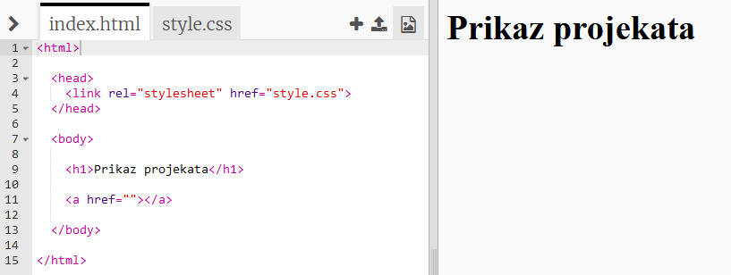
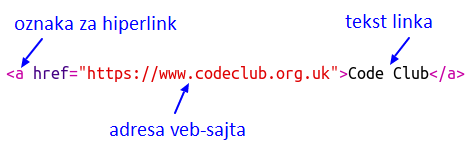
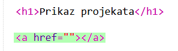
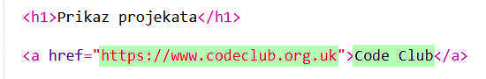
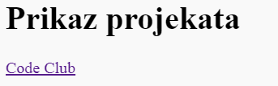
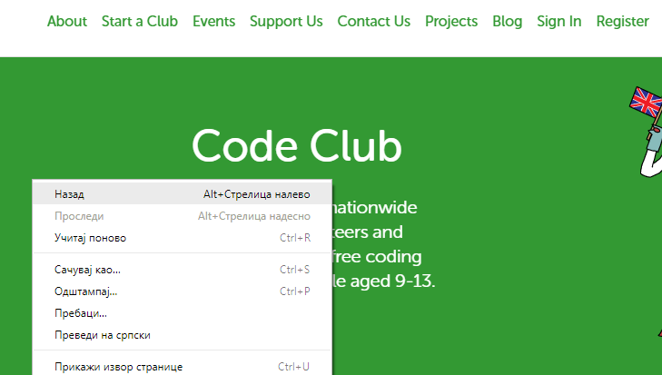
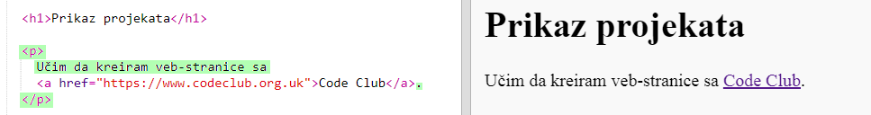

## Dodavanje linkova za veb-stranice

Tekstualni linkovi omogućuju ti da klikneš na riječi i pređeš na drugu veb-stranicu; oni su obično podvučeni.

+ Otvori sljedeći trinket: [jumpto.cc/web-showcase](http://jumpto.cc/web-showcase).
    
    Projekat treba da izgleda ovako:
    
    

+ HTML koristi oznaku `<a>` za linkove.

+ Pronađi oznaku `<a>` u svom projektu. 

+ Dodaj adresu veb-sajta Code Club-a [`https://www.codeclub.org.uk`](https://www.codeclub.org.uk) i tekst linka:

+ Klikni na 'Run' da isprobaš svoj trinket.

+ Klikni na link Code Club da isprobaš svoju veb-stranicu. Tvoj trinket će sada prikazati veb-stranicu Code Club-a: 

+ Za povratak na svoju stranicu možeš:
    
    + Ponovo pokrenuti (run) svoj trinket,
    
    + Pritisnuti taster 'Backspace' na tastaturi ili
    
    + Kliknuti desnim tasterom miša i izabrati Nazad.

+ Sada postavi svoj link u rečenicu unutar pasusa:

Isprobaj svoju veb-stranicu.