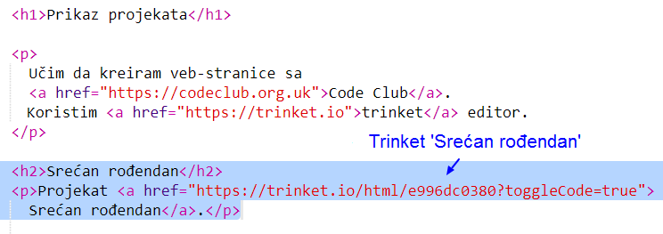
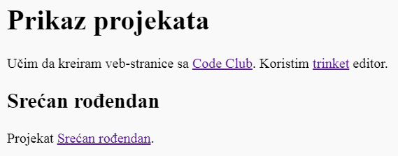

## Link za trinket

Možeš da se povežeš sa veb-stranicom trinketa.

+ Da li imaš sačuvan link svog trinketa 'Srećan rođendan'? Ako ga imaš, otvori taj trinket u novoj kartici ili prozoru pregledača. U suprotnom, otvori trinket sa završenim primjerom: <https://trinket.io/html/de64e9e3db>

+ Klikni na meni 'Share' iznad svog trinketa i izaberi 'Link':

If you opened the trinket from your account then look for the Share option above your trinket instead:

+ Izaberi 'Only show code or result (let users toggle between them)' i kopiraj link za trinket. 

+ Vrati se na svoj trinket 'Prikaz projekata' i dodaj `<h2>` naslov i link za svoj projekat 'Srećan rođendan'.

Isprobaj svoju veb-stranicu; trebalo bi da izgleda poput ove:

Klikni na link Srećan rođendan i provjeri otvara li se taj trinket.