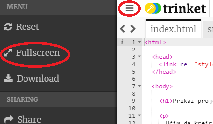
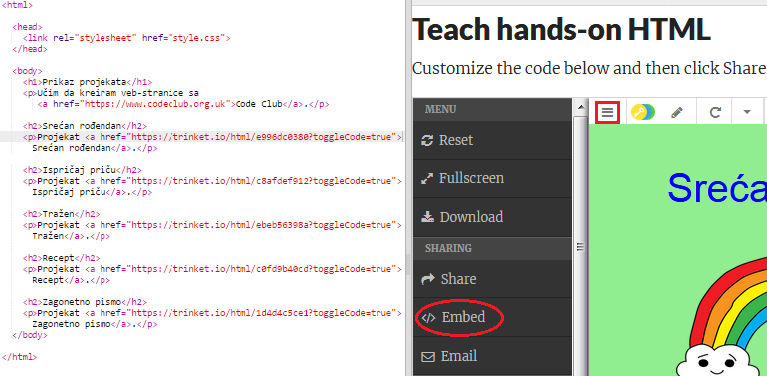
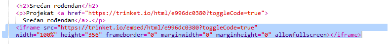
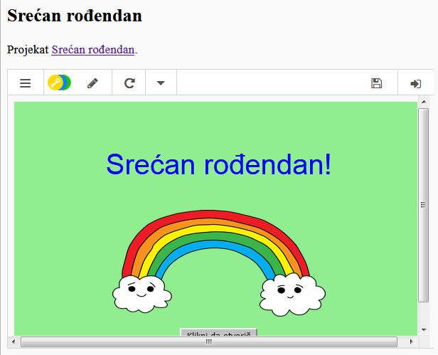
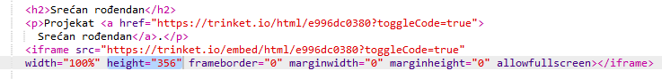
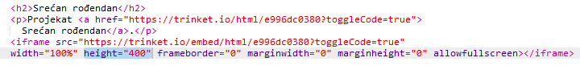

## Ugrađivanje projekata

Osim povezivanja trinketa kao veb-stranica, možemo ih i ugraditi na veb-stranicu.

+ Možeš da probaš da radiš u režimu cijelog ekrana (Fullscreen mode), kako bi imao/imala više prostora:

Za izlazak iz režima cijelog ekrana pritisni taster Esc.

+ Pokreni svoj trinket i klikni na link Srećan rođendan.

+ Klikni na meni trinketa i izaberi **embed** (ugraditi). Ako ne radiš u režimu cijelog ekrana, možda ćeš morati da pomjeraš sadržaj. Koristi kliznu traku sa desne strane ili strelicu nadolje na tastaturi.

+ Izaberi 'Only show code or result (let users toggle between them)' i **kopiraj** kôd za ugrađivanje trinketa. 

+ Trinket je kreirao HTML koji treba da uneseš na svoju veb-stranicu. On koristi oznaku `<iframe>` koja omogućuje da se sadržaj ugradi na stranicu.

+ Sada prenesi taj kôd ispod linka za trinket Srećan rođendan:

+ Pokreni svoj trinket da ga isprobaš. Trebalo bi da vidiš svoj projekat Srećan rođendan ugrađen na veb-stranicu. 

+ Može se desiti da se ne prikazuje donji dio tvog trinketa. To možeš popraviti tako što ćeš promijeniti vrijednost visine (height) u `<iframe>`. 

Postavi visinu na **400**. Ako si napravio/napravila izmjene u projektu Srećan rođendan, možda će biti potrebno da izabereš neku drugu vrijednost.

