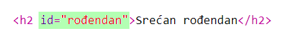
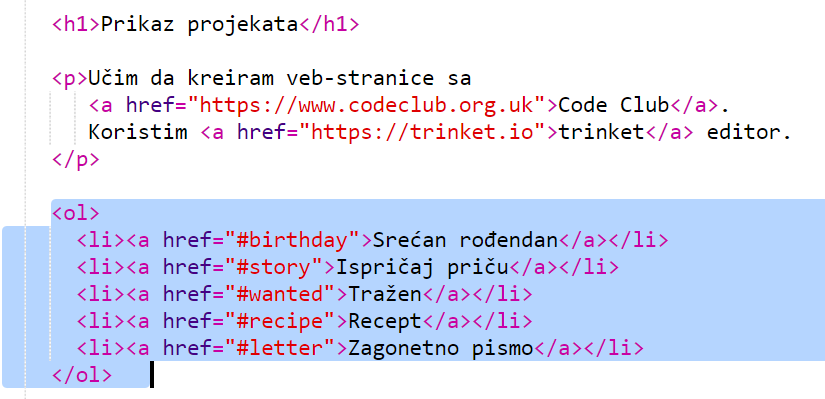
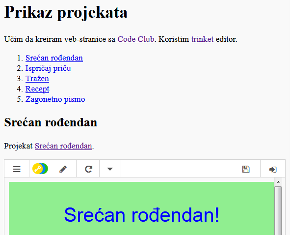

## Napravi sadržaj

Dodajmo sadržaj kako bismo lako došli do određenog projekta.

+ Kao što možemo da se povežemo sa drugim veb-stranicama, možemo se povezati sa dijelovima veb-stranice ako im dodijelimo id (identifikator). 

Dodaj id `<h2>` naslovu za projekat Srećan rođendan:

+ Dodaj id svakom od svojih projekata i daj im kratke nazive: priča, tražen, recept i pismo.

+ Sa elementom koji ima id možeš da se povežeš tako što ćeš unijeti znak taraba ‘#’ ispred njegovog naziva. Na primjer `#rođendan`.

Kreiraj uređenu listu linkova za svoje projekte. (Sa uređenim listama upoznali smo se u projektu Recept.)

+ Pokreni projekat i isprobaj ga tako što ćeš kliknuti na linkove da pristupiš svojim projektima. 

