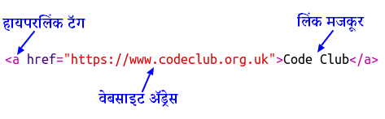

## वेबपेजेस वर लिंक जोडणे

लिंक्स आपल्याला एखाद्या दुसऱ्या वेबपेजवर जाण्यासाठी शब्दांवर क्लिक करण्याची सुविधा देतात; ते सहसा अधोरेखित असतात.

+ हे ट्रिंकेट उघडा: [jumpto.cc/web-showcase](http://jumpto.cc/web-showcase).
    
    प्रकल्प असा दिसायला हवा:
    
    

+ HTML मध्ये लिंक साथी `<a>` टॅग वापरला जातो.

+ तुमच्या प्रकल्पातला `<a>` टॅग शोधा. 

+ Code Club च्या वेबसाईटचा पत्ता [`https://www.codeclub.org.uk`](https://www.codeclub.org.uk) आणि मजकूर जोडा:

+ आपल्या ट्रिंकेटची चाचणी घेण्यासाठी रन वर क्लिक करा.

+ तुमच्या वेबपेजला तपासण्यासाठी Code Club च्या लिंक वर क्लिक करा. आपले ट्रिंकेटआता Code Club वेबपेज दाखवेल: 

+ आपल्या वेबपेजवर परत येण्यासाठी आपण हे करू शकता:
    
    + आपले ट्रिंकेट पुन्हा एकदा चालवा,
    
    + कीबोर्डवरील बॅकस्पेस की(key) दाबा, किंवा
    
    + राइट-क्लिक करा आणि बॅक (back) चा पर्याय निवडा.

+ आता आपली लिंक एका वाक्याच्या आत टाका:

आपल्या वेबपेजची चाचणी घ्या.