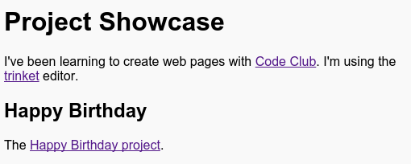

## ट्रिंकेटची लिंक

आपण trinket च्या वेबपेजची लिंक वापरू शकता.

+ आपल्या जवळ वाढदिवसाच्या शुभेच्छापत्राच्या trinket ची लिंक आहे का? जर असेल तर ती ट्रिंकेट एका दुसऱ्या ब्राऊजर टॅब किंवा विंडो मध्ये उघडा. अथवा हि तयार झालेली trinket उघडा: <https://trinket.io/html/e996dc0380>

+ आपल्या ट्रिंकेटच्या वरील शेयर मेन्यूवर क्लिक करा आणि लिंक निवडा:

आपण आपल्या खात्यातून ट्रिंकेट उघडले असेल तर त्याऐवजी आपल्या ट्रिंकेटच्या वरील शेयर पर्यायाचा वापर करावा:

+ 'Only show code or result (let users toggle between them)' पर्याय निवडा आणि trinket ची लिंक कॉपी करा. 

+ प्रकल्प शोकेस ट्रिंकेट ला परत जा आणि एक `<h2>` शीर्षक आणि तुमच्या वाढदिवसाच्या शुभेच्छापत्र प्रकल्पाची लिंक टाका.

आपले वेबपेज असे दिसले पाहिजे:

हे आपल्याला ट्रिंकेटवर घेऊन जाते याची खात्री करण्यासाठी हॅप्पी बर्थडे लिंकवर क्लिक करा.