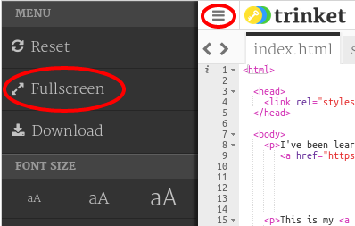

## प्रकल्प एंबेड करणे

आपण ट्रिंकेट्स ची लिंक वेबपेज वर टाकण्या सोबतच आपण त्यांना वेबपेज मध्ये एम्बेड सुद्धा करू शकतो.

+ तुम्हाला जागा पुरत नसल्यास तुम्ही फुलस्क्रीन पर्यायाचा वापर करू शकता:

फुलस्क्रीन मोडमधून बाहेर पडण्यासाठी Esc दाबा.

+ आपले ट्रिंकेट रन करा आणि हॅप्पी बर्थडे लिंकवर क्लिक करा.

+ Trinket मेन्यू वर क्लिक करा आणि **embed** वर क्लिक करा. आपण फुलस्क्रीन मोडमध्ये नसाल तर आपल्याला स्क्रोल करावे लागू शकते. उजवीकडील स्क्रोल बार किंवा कीबोर्ड वरचा खालचा बाणाचा वापर करा.

+ 'Only show code or result (let users toggle between them)' पर्याय निवडा आणि trinket साठीचा एम्बेड कोड **कॉपी** करा. 

+ आपल्या वेबपेजमध्ये समाविष्ट करण्यासाठी ट्रिन्केटने काही HTML तयार केले आहे. त्यात `<iframe>` टॅगचा वापर होतो ज्याचा वापर करून तुम्ही वेबपेज मध्ये माहिती एम्बेड करू शकता.

+ आता हॅप्पी बर्थडे ट्रिंकेटच्या लिंकखाली तो कोड पेस्ट करा:

+ तपासून पाहण्यासाठी आपले ट्रिंकेट रन करा आणि तुम्हाला हॅप्पी बर्थडे प्रकल्प वेबपेज मध्ये एम्बेड झालेला दिसेल. 

+ आपणास असं आढळेल की आपल्या trinket च्या तळाचा भाग दिसत नाही आहे. तुम्ही ते `<iframe>` ची height बदलून ठीक करू शकता. 

Height ला **400** करा. जर तुम्ही हॅप्पी बर्थडे प्रकल्पात बदल केलेले असतील तर तुम्हाला वेगळा आकडा वापरावा लागू शकतो.

