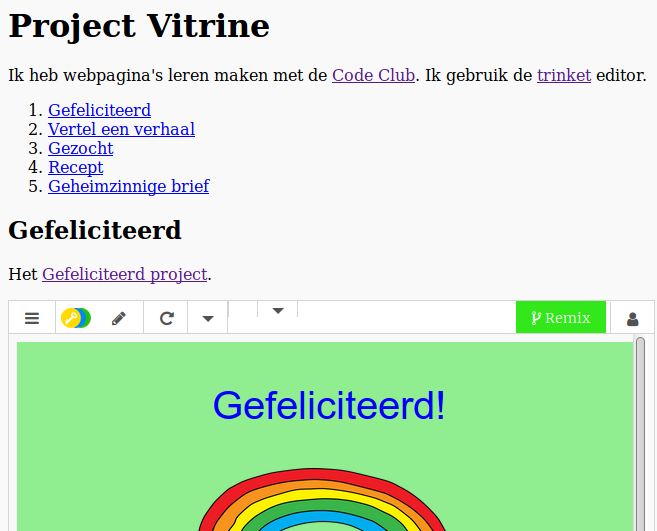

## Invoering

In dit project maak je een showcase van je HTML-projecten en leer je over links en bronnen insluiten.

### Aanvullende informatie voor clubleiders

Als u dit project wilt afdrukken, gebruik dan de [Printervriendelijke versie](https://projects.raspberrypi.org/en/projects/project-showcase/print).

## \--- ineenstorting \---

## titel: Clubleider notities

## Invoering:

In dit project maken kinderen kennis met hyperlinks en nemen trinkets en Scratch-projecten op in een webpagina.

## Online bronnen

We raden aan [trinket](https://trinket.io/) te gebruiken om HTML & CSS online te schrijven. Dit project bevat de volgende trinket:

* ['Project Showcase' uitgangspunt - jumpto.cc/web-letter](http://jumpto.cc/web-letter)

Kinderen kunnen ook gebruik maken van dit lege trinket [(jumpto.cc/html-blank)](http://jumpto.cc/html-blank) om hun eigen HTML & CSS te schrijven, of ze kunnen deze sjabloontrinket [(jumpto.cc/html-template)](http://jumpto.cc/html-template) gebruiken.

Er is ook een trinket met een voorbeeldoplossing voor de uitdagingen:

* ['Project Showcase Finished' - trinket.io/html/5b815ab120](https://trinket.io/html/5b815ab120)

## Offline bronnen

Dit project kan [als het offline is](https://www.codeclubprojects.org/en-GB/resources/webdev-working-offline/) zijn voltooid als dit de voorkeur heeft. U kunt toegang krijgen tot de projectbronnen door op de koppeling 'Projectmaterialen' voor dit project te klikken. Deze link bevat een gedeelte 'Projectresources', dat bronnen bevat die kinderen nodig hebben om dit project offline te voltooien. Zorg ervoor dat elk kind toegang heeft tot een kopie van deze bronnen. Dit gedeelte bevat de volgende bestanden:

* project-showcase / index.html
* project-showcase / style.css
* template / template.html
* template / style.css

Je kunt ook een voltooide versie van de uitdagingen van dit project vinden in de sectie 'Vrijwilligersbronnen', die bevat:

* project-showcse afgewerkte / index.html
* project-showcse afgewerkte / style.css

(Alle bovenstaande bronnen kunnen ook worden gedownload als project en als vrijwilliger `.zip` bestanden.)

Let op: als de kinderen hun andere projecten offline hebben voltooid, kunnen ze deze niet insluiten, maar kunnen ze nog steeds naar hen linken.

## leerdoelen

* Dit project introduceert tekstkoppelingen naar andere webpagina's en benoemde ID's binnen een pagina. Het introduceert ook het insluiten van snuisterijen en Scratch-projecten in een webpagina. 

Dit project behandelt elementen uit de volgende onderdelen van het [Raspberry Pi Digital Making Curriculum](http://rpf.io/curriculum):

* [Ontwerp standaard 2D- en 3D-objecten](https://www.raspberrypi.org/curriculum/design/creator).

## Uitdagingen

* "Voeg nog een link toe" - Voeg links toe naar meer webpagina's;
* "Maak een lijst met uw projecten" - Maak links naar eerdere webprojecten;
* "Meer projecten insluiten" - Gebruik CSS om nieuwe stijlen te maken.

\--- / inklappen \---

## \--- ineenstorting \---

## titel: Projectmaterialen

## Project middelen

* [.zip-bestand met alle projectbronnen](resources/showcase-project-resources.zip)
* [Online Trinket met alle projectbronnen van 'Project Showcase'](http://jumpto.cc/web-showcase)
* [Online Trinket-sjabloon](http://jumpto.cc/trinket-template)
* [Online lege Trinket](http://jumpto.cc/trinket-blank)
* [template / index.html](resources/template-index.html)
* [template / style.css](resources/template-style.css)
* [project-showcase / index.html](resources/project-showcase-index.html)
* [project-showcase / style.css](resources/project-showcase-style.css)

## Club leider middelen

* [.zip-bestand met alle voltooide projectresources](resources/showcase-volunteer-resources.zip)
* [Online voltooid Trinket-project](https://trinket.io/html/1d4d4c5ce1)
* [project-showcase-finished / index.html](resources/project-showcase-finished-index.html)
* [project-showcase-finished / style.css](resources/project-showcase-finished-style.css)

\--- / inklappen \---