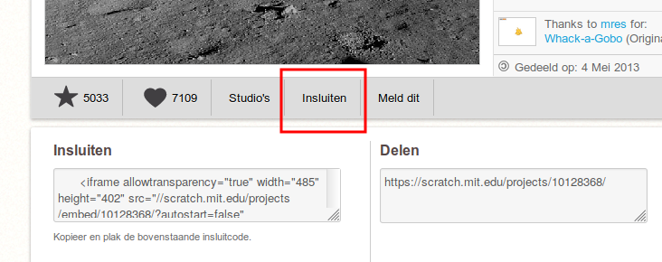
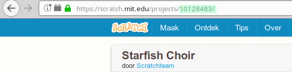
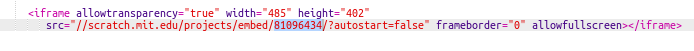

\--- uitdaging \---

## Uitdaging: maak een nieuwe showcase

Snuisterijen zijn niet het enige dat u kunt insluiten in een webpagina. U kunt video's, widgets (zoals een weer-widget) of Scratch-projecten insluiten.

Open de trinket Krasvoorbeelden insluiten en voer het uit: <https://trinket.io/html/9f7212b8fe>

Ga naar de Scratch-website en vind een project dat u bevalt. Het kan een van jezelf zijn of een die je hebt gevonden.

Als u bent ingelogd, kunt u op de knop 'Insluiten' onder het project klikken om de HTML-insluitcode te krijgen.

Als u niet bent aangemeld, zoekt u naar het Scratch-projectnummer in zijn webadres.

Maak een kopie van de `<iframe>` code in het Scratch Embed-voorbeeld en verander het projectnummer naar het projectnummer voor het project dat u wilt insluiten:

\--- / uitdaging \---