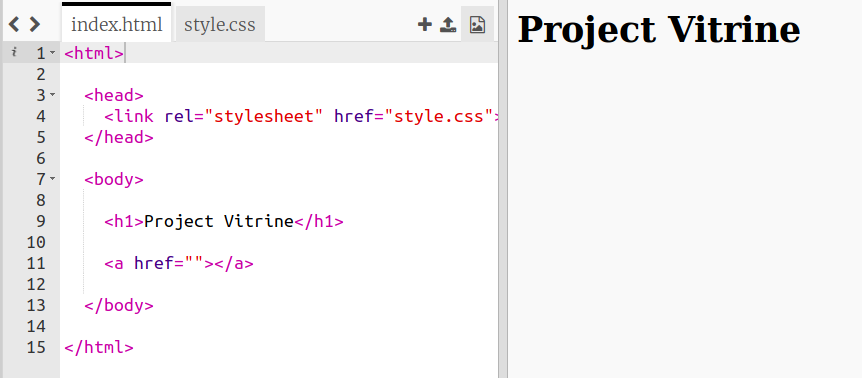

## Links toevoegen aan webpagina's

Met tekstlinks kunt u op woorden klikken om naar een andere webpagina te gaan; ze zijn meestal onderstreept.

+ Open this trinket: [jumpto.cc/web-showcase](http://jumpto.cc/web-showcase).
    
    Het project zou er als volgt uit moeten zien:
    
    

+ HTML gebruikt de `<a>` -tag voor koppelingen.

+ Zoek de `<a>` tag in uw project. 

+ Voeg het Code Club-websiteadres [`https://www.codeclub.org.uk`](https://www.codeclub.org.uk) en linktekst toe:

+ Klik op Uitvoeren om je trinket te testen.

+ Klik op de koppeling Code Club om uw webpagina te testen. Je trinket toont nu de webpagina van de Code Club: 

+ Om terug te gaan naar uw pagina kunt u:
    
    + Ren je trinket opnieuw,
    
    + Tik op de Backspace-toets op het toetsenbord of
    
    + Klik met de rechtermuisknop en kies Terug.

+ Plaats nu je link in een zin in een alinea:

Test uw webpagina.