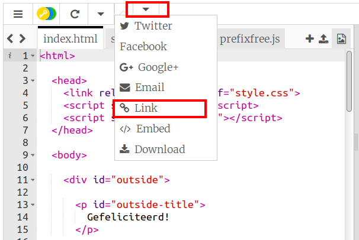
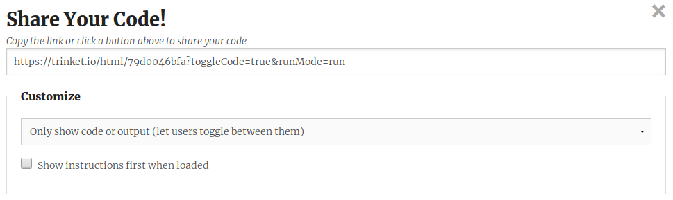
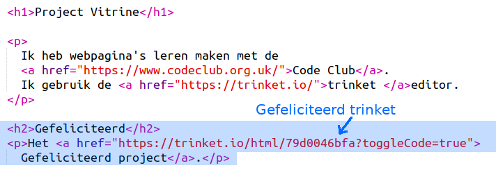
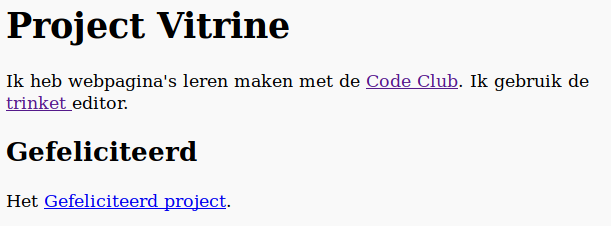

## Link naar een Trinket

Voor een trinket kun je naar een webpagina linken.

+ Heb je een link naar je trinket voor Gefeliciteerd bewaard? Zo ja, open dan die trinket in een ander browsertabblad of -venster. Anders kun je het voltooide voorbeeld-trinket openen: <https://trinket.io/html/79d0046bfa>

+ Klik op het menu Share (Engels voor Delen) boven je trinket en kies Link:

Als je de trinket vanuit je eigen account hebt geopend, zoek je in plaats daarvan de optie Share onder je trinket:

+ Kies 'Only show code or output (let users toggle between them)' en kopieer de link naar de trinket. 

+ Ga terug naar je trinket Project Vitrine en voeg een `<h2>` -kop toe en een link naar je Gefeliciteerd-project.

Test de webpagina; het zou er ongeveer zo uit moeten zien:

Klik op de koppeling Gefeliciteerd om te testen of je naar de trinket gaat.