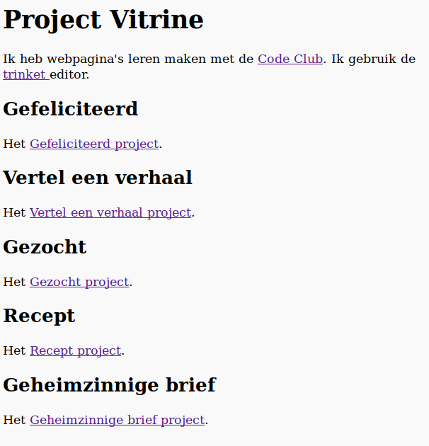

\--- challenge \---

## Uitdaging: maak een lijst van je projecten

Voeg een paar andere HTML & CSS-projecten toe die je bij Code Club hebt gemaakt. Gebruik `<h2>` koppen om je webpagina te structureren.

Als je geen links hebt naar afgeronde projecten kun je Code Club-voorbeelden gebruiken:

+ Gefeliciteerd: [https://trinket.io/html/79d0046bfa](https://trinket.io/html/e996dc0380)

+ Vertel een verhaal: [https://trinket.io/html/0d9fedef26](https://trinket.io/html/c8afdef912)

+ Gezocht!: [https://trinket.io/html/adcbb504b3](https://trinket.io/html/ebeb56398a)

+ Recept: [https://trinket.io/html/8ca90000e9](https://trinket.io/html/c0fd9b40cd)

+ Geheimzinnige brief: [https://trinket.io/html/e4be43d3c6](https://trinket.io/html/1d4d4c5ce1)

De voltooide pagina zou er ongeveer zo uit moeten zien:

\--- /challenge \---