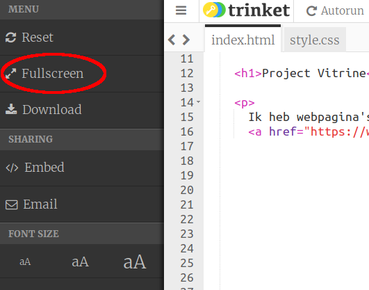
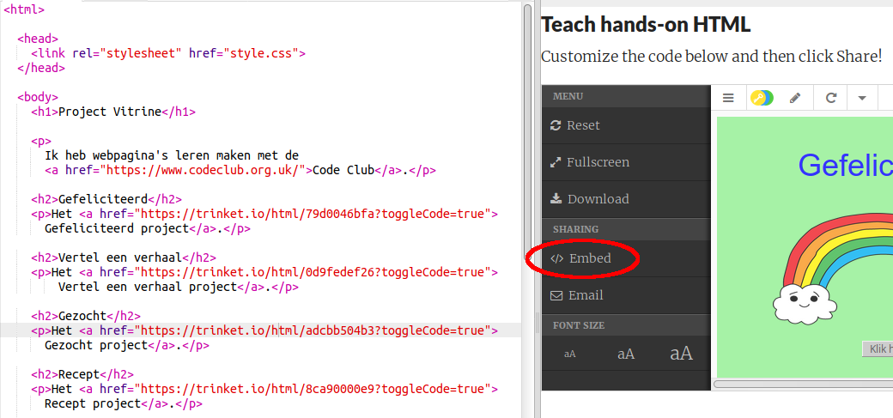
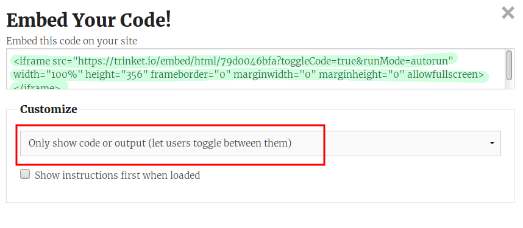
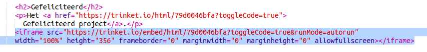
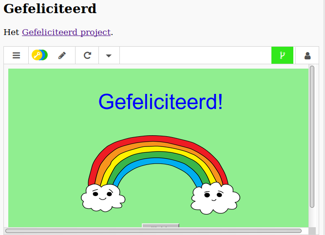
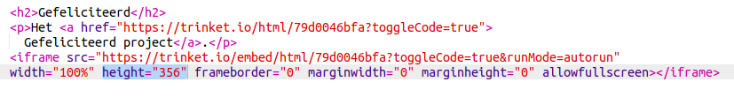
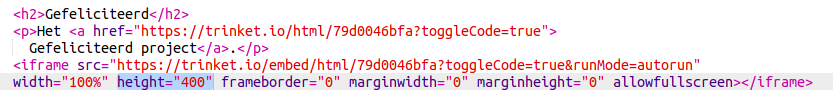

## Projecten insluiten

Naast het linken naar trinkets webpagina's kunnen we ze ook in een webpagina insluiten (Engels: embedding).

+ Probeer eens te werken in de modus Volledig scherm (Engels: Fullscreen), om meer ruimte te maken:

Druk op Esc om de modus Volledig scherm te verlaten.

+ Voer je trinket uit en klik op de link Gefeliciteerd.

+ Klik op het trinket-menu en selecteer **embed**. Als je niet in de modus Volledig scherm zit moet je misschien scrollen. Gebruik de schuifbalk aan de rechterkant of de pijl omlaag op het toetsenbord.

+ Kies 'Only show code or output (let users toggle between them)' en **kopieer** de insluitcode voor de trinket. 

+ Trinket heeft wat HTML voor je gemaakt om op de webpagina op te nemen. Het maakt gebruik van een `<iframe>` tag waarmee materiaal kan worden ingesloten op een pagina.

+ Plak die code nu onder de link naar de trinket Gefeliciteerd!:

+ Voer je trinket uit om te testen, het Gefeliciteerd-project zou nu op de webpagina ingesloten moeten zijn. 

+ Het kan zijn dat de onderkant van de trinket niet wordt weergegeven. Je kunt dit herstellen door de waarde van de hoogte (Engels: height) in `<iframe>` aan te passen. 

Stel de hoogte in op **400**. Als je het Gefeliciteerd-project hebt veranderd moet je mogelijk een andere waarde kiezen.

