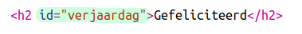
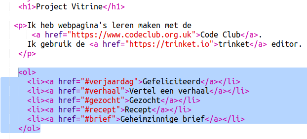
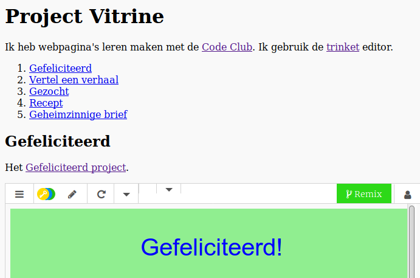

## Maak een inhoudsopgave

We gaan een inhoudsopgave toevoegen, zodat we gemakkelijk bij elk project kunnen komen.

+ Naast de mogelijkheid om naar andere webpagina's te linken, kunnen we ook naar delen van een webpagina linken, als we dat een 'id' geven. 

Voeg een id toe aan de `<h2>` kop voor het project Gefeliciteerd!:

+ Voeg id's toe aan al je projecten en geef ze korte namen: verhaal, gezocht, recept en letter.

+ Je kunt naar een element met een id linken door een hekje '#' voor de naam te zetten. Bijvoorbeeld `#verjaardag`.

Maak een geordende lijst met links naar je projecten. (Geordende lijsten worden behandeld in het project Recept.)

+ Voer je project uit en test het door op de links te klikken om naar uw projecten te gaan. 

