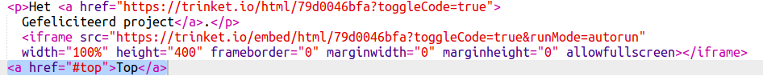
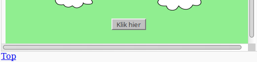

## Terug naar de top

+ Het is ook handig om terug te kunnen navigeren naar de bovenkant van de pagina. HTML heeft `#top` voor dit doel.

+ Voeg na elk ingesloten project op uw webpagina een link toe naar `#top`:

+ Test uw links door op Top te klikken om terug te keren naar de bovenkant van de pagina.