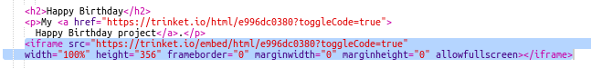

## Embedding Prosjekter

I tillegg til å knytte til pyntegjenstander som nettsider kan vi også legge dem inn i en nettside.

+ Du vil kanskje prøve å jobbe i fullskjermmodus slik at du har mer plass:

Trykk på Esc for å gå ut av fullskjermmodus.

+ Kjør din pyntegjenstander og klikk på Happy Birthday-lenken.

+ Klikk på trinket-menyen og velg **embed**. Hvis du ikke er i fullskjermmodus, må du kanskje bla. Bruk rullefeltet til høyre eller pil ned på tastaturet.

+ Velg 'Vis kun kode eller resultat (la brukerne bytte mellom dem)' og **kopier** innbygningskoden for pyntegjenstander. 

+ Trinket har laget litt HTML for at du skal inkludere i din nettside. Den bruker en `<iframe>` tag som tillater innhold å være innebygd på en side.

+ Lim inn denne koden under linken til Gratulerer med dagen:

+ Kjør din pyntegjenstander for å teste den, og du bør se ditt Gratulerer-prosjekt innlemmet i nettsiden. 

+ Det kan hende du finner at bunnen av snufetten din ikke vises. Du kan fikse det ved å endre høydeverdien på `<iframe>`. 

Still høyden til **400**. Hvis du har gjort endringer i Happy Birthday-prosjektet, må du kanskje velge en annen verdi.

