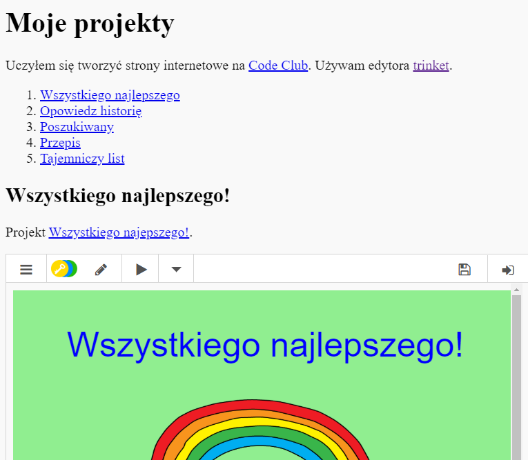

## Wprowadzenie

W tym projekcie stworzysz listę swoich projektów HTML i dowiesz się jak tworzyć linki oraz osadzać elementy na stronie internetowej.

### Dodatkowe informacje dla prowadzących klub

Jeśli chcesz wydrukować ten projekt, użyj [wersji do druku](https://projects.raspberrypi.org/en/projects/project-showcase/print).

## \--- collapse \---

## title: Notatki dla liderów klubów

## Wstęp:

W tym projekcie dzieci poznają zagadnienie hiperłączy oraz osadzania szablonów i projektów Scratch w stronie internetowej.

## Zasoby Online

Do pisania kodu HTML i CSS online rekomendujemy użytkowanie edytora [trinket](https://trinket.io/). Do tego projektu udostępnione są następujące szablony:

* ['Moje projekty' - początek – jumpto.cc/web-showcase](http://jumpto.cc/web-showcase)

Dzieci mogą też używać pustego edytora [(jumpto.cc/html-blank)](http://jumpto.cc/html-blank) do pisania swojego kodu HTML i CSS lub skorzystać z tego szablonu [(jumpto.cc/html-template)](http://jumpto.cc/html-template).

Dostępny jest także projekt zawierający przykładowe rozwiązania wyzwań:

* ['Moje projekty - skończone' - trinket.io/html/5b815ab120](https://trinket.io/html/5b815ab120)

## Zasoby Offline

Ten projekt można także [wykonać offline](https://www.codeclubprojects.org/en-GB/resources/webdev-working-offline/). Materiały potrzebne do wykonania projektu dostępne są po kliknięciu linku "Materiały do projektu". Można znaleźć tam sekcję "Zasoby", która zawiera zasoby potrzebne dzieciom do wykonania projektu w trybie offline. Upewnij się, że każde dziecko ma dostęp do własnej kopii zasobów. Ta sekcja zawiera następujące pliki:

* project-showcase/index.html
* project-showcase/style.css
* template/template.html
* template/style.css

Ukończoną wersję zadań z tego projektu można również znaleźć w sekcji "Zasoby dla wolontariuszy", która zawiera:

* project-showcse-finished/index.html
* project-showcse-finished/style.css

(Wszystkie powyższe zasoby można również pobrać jako pliki `.zip`.)

Zauważ, że jeśli dzieci ukończyły inne swoje projekty w trybie offline, nie będą w stanie osadzić ich na stronie, ale będą w stanie stworzyć do nich odnośniki.

## Cele dydaktyczne

* Ten projekt wprowadza zagadnienie odnośników tekstowych do innych stron internetowych oraz określonych id zawartych w stronie. Wprowadza również osadzanie szablonów oraz projektów Scratch w stronach internetowych. 

Projekt ten obejmuje następujące elementy [Cyfrowego programu nauczania Raspberry Pi](http://rpf.io/curriculum):

* [Projektowanie podstawowych zasobów 2D i 3D](https://www.raspberrypi.org/curriculum/design/creator).

## Wyzwania

* 'Dodaj kolejny link' - Dodaje odnośniki do stron internetowych;
* 'Stwórz listę swoich projektów' - Tworzy odnośniki do poprzednich projektów;
* 'Osadź więcej projektów' - Użyj CSS, aby stworzyć nowe style.

\--- /collapse \---

## \--- collapse \---

## title: Materiały do projektu

## Zasoby projektu

* [Plik.zip zawierający wszystkie zasoby potrzebne do wykonania projektu](resources/showcase-project-resources.zip)
* [Szablon startowy zawierający wszystkie zasoby potrzebne do realizacji projektu "Moje projekty"](http://jumpto.cc/web-showcase)
* [Szablon online edytora Trinket](http://jumpto.cc/trinket-template)
* [Pusty szablon online edytora Trinket](http://jumpto.cc/trinket-blank)
* [template/index.html](resources/template-index.html)
* [template/style.css](resources/template-style.css)
* [project-showcase/index.html](resources/project-showcase-index.html)
* [project-showcase/style.css](resources/project-showcase-style.css)

## Zasoby dla lidera klubu

* [Plik.zip zawierający zasoby z ukończonym projektem](resources/showcase-volunteer-resources.zip)
* [Ukończony online projekt Trinket](https://trinket.io/html/1d4d4c5ce1)
* [project-showcse-finished/index.html](resources/project-showcase-finished-index.html)
* [project-showcse-finished/style.css](resources/project-showcase-finished-style.css)

\--- /collapse \---