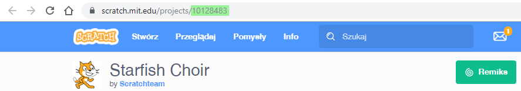

\--- challenge \---

## Wyzwanie: stwórz nową prezentację

Szablony nie są jedyną rzeczą, którą możesz osadzić na swojej stronie. Możesz osadzić w niej filmy, widget (na przykład widget pogodowy) czy projekt Scratch.

Otwórz przykładowy szablon do osadzenia projektu Scratch i uruchom go: <https://trinket.io/html/9f7212b8fe>

Odwiedź stronę internetową Scratch i znajdź projekt, który podoba ci się najbardziej. Możesz wybrać jeden ze swoich projektów lub dowolny projekt ze strony.

Jeśli jesteś zalogowany, możesz kliknąć przycisk 'Embed' (ang. osadź) poniżej wybranego projektu, aby uzyskać jego kod HTML.

Jeśli nie jesteś zalogowany, poszukaj numeru projektu Scratch w adresie strony.

Zrób kopię `<iframe>` kodu z przykładu osadzania projektu Scratch i zmień numer projektu na taki, który chcesz zobaczyć na swojej stronie:

\--- /challenge \---